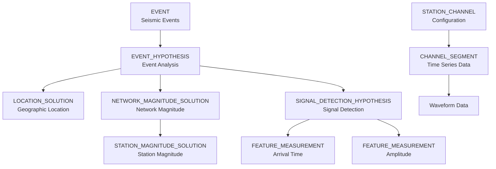

# SchemaTest1 - NDC PLUS Database Schema

A comprehensive database schema management system with visual documentation for the **NDC (National Data Center) PLUS** seismic monitoring system, presented with GitHub integration similar to Swagger for APIs.

## 📊 Overview

This repository maintains the NDC PLUS Oracle database schema with rich visual documentation rendered directly in GitHub. The schema supports seismic event monitoring, waveform analysis, and location determination.

**Key Features**:
- 📄 **Source Schema**: Original table definitions in text format
- 🔄 **Automated Parser**: Python tool to extract and process schema
- 📋 **JSON Schema**: Machine-readable schema specification
- 📊 **Visual Documentation**: Mermaid diagrams showing entity relationships
- 🎨 **Swagger-like Interface**: Comprehensive table and column documentation

## 🗂️ Repository Structure

```
SchemaTest1/
├── NDC_PLUS_tables.txt         # Source schema definition (35 tables)
├── tools/
│   └── parse_schema.py         # Schema parser and doc generator
├── schema/
│   ├── docs/
│   │   └── NDC_PLUS_SCHEMA.md  # Visual schema documentation
│   └── ndc_plus_schema.json    # Machine-readable schema specification
└── README.md                    # This file
```

## 📖 Documentation

### 🔍 View Complete Schema Documentation

**[📊 NDC PLUS Schema Documentation](schema/docs/NDC_PLUS_SCHEMA.md)**

The documentation includes:
- ✅ Table categorization by functional area
- ✅ Interactive relationship diagrams (Mermaid)
- ✅ Detailed specifications for all 35 tables
- ✅ Column types, nullability, and primary keys
- ✅ Foreign key relationships and references
- ✅ Oracle-specific data types

### 📊 Schema Statistics

- **Total Tables**: 35
- **Database Type**: Oracle
- **Primary Key Pattern**: UUID (RAW(16))
- **Key Table Categories**:
  - Channel & Waveform Data (5 tables)
  - Event Management (6 tables)
  - Feature Measurements (4 tables)
  - Location & Uncertainty (6 tables)
  - Magnitude Calculations (2 tables)
  - Quality Control (3 tables)
  - Signal Detection (2 tables)
  - Metadata & Configuration (4 tables)

### Quick Relationship Overview



## 🚀 Getting Started

### Prerequisites

- Python 3.6+ (for schema parser)
- Oracle Database (for deploying the schema)
- Git (for version control)

### Regenerating Documentation

If you modify the schema or need to regenerate documentation:

1. **Clone the repository**:
   ```bash
   git clone https://github.com/jwehlen-cell/SchemaTest1.git
   cd SchemaTest1
   ```

2. **Update the source schema** (if needed):
   ```bash
   # Edit NDC_PLUS_tables.txt with your changes
   nano NDC_PLUS_tables.txt
   ```

3. **Run the schema parser**:
   ```bash
   python3 tools/parse_schema.py
   ```

4. **View generated documentation**:
   - JSON Schema: `schema/ndc_plus_schema.json`
   - Markdown Docs: `schema/docs/NDC_PLUS_SCHEMA.md`

### Using the Schema Parser

The `parse_schema.py` tool automatically:
- ✅ Parses the text-based schema file
- ✅ Extracts table and column definitions
- ✅ Identifies foreign key relationships
- ✅ Generates JSON schema documentation
- ✅ Creates comprehensive Markdown documentation with diagrams

```bash
# Run the parser
cd SchemaTest1
python3 tools/parse_schema.py

# Output:
# ✓ Found 35 tables
# ✓ Found 35 relationships
# ✓ Generated JSON schema
# ✓ Generated Markdown documentation
```

## 📋 Schema Organization

### Table Categories

#### 1️⃣ Channel & Waveform Data
Tables for managing seismic waveform data and channel segments:
- `CHANNEL_SEGMENT` - Time series channel segment information
- `CHANNEL_SEGMENT_CREATION` - Creation metadata
- `CHANNEL_SEGMENT_PROC_MASK_XREF` - Processing mask cross-references
- `CHANNEL_SEGMENT_WAVEFORM` - Waveform ID linkage
- `STATION_CHANNEL` - Station and channel configuration

#### 2️⃣ Event Management
Core tables for seismic event tracking:
- `EVENT` - Master event table
- `EVENT_HYPOTHESIS` - Event characteristic hypotheses
- `EVENT_HYPOTHESIS_TAG` - Event classifications
- `EVENT_STATUS_INFO` - Workflow status
- `EVENT_CORRELATION` - Event correlation analysis
- `EVENT_CORRELATION_CHANNEL_SEGMENT` - Correlation channel data

#### 3️⃣ Feature Measurements & Predictions
Signal analysis and predictions:
- Measurement tables for amplitude, arrival time, numeric, and enumerated features
- Prediction tables for arrival time, components, and numeric features

#### 4️⃣ Location & Magnitude
Geographic location and magnitude calculations:
- Location solutions with uncertainty representations
- Network and station-level magnitude solutions

## 🔍 Key Features

### Visual Documentation (Swagger-like)

Similar to how Swagger provides interactive API documentation, this repository provides:

- ✅ **Entity Relationship Diagrams**: Visual representation using Mermaid
- ✅ **Categorized Tables**: Organized by functional domain
- ✅ **Detailed Specifications**: Complete column information with types
- ✅ **Relationship Tracking**: Foreign key identification and visualization
- ✅ **Machine-Readable Format**: JSON schema for automation
- ✅ **GitHub Native Rendering**: No external tools needed to view

### GitHub Integration Benefits

- **Native Rendering**: Mermaid diagrams render directly in GitHub
- **Version Control**: Full history of schema changes
- **Pull Requests**: Review schema modifications before merging
- **Search**: Find tables and columns using GitHub search
- **Issues**: Track schema enhancements and bugs
- **Automation**: CI/CD can validate schema changes

## 🛠️ Usage Examples

### For Developers

```python
# Load and use the JSON schema
import json

with open('schema/ndc_plus_schema.json', 'r') as f:
    schema = json.load(f)

# Get table information
for table_name, table_info in schema['tables'].items():
    print(f"Table: {table_name}")
    print(f"Description: {table_info['description']}")
    print(f"Columns: {len(table_info['columns'])}")
```

### For DBAs

```sql
-- The schema uses Oracle-specific types
-- Example: UUID columns use RAW(16)
-- Example: Timestamps use TIMESTAMP(6)

-- Review table structure
DESC CHANNEL_SEGMENT;

-- Check relationships
SELECT * FROM USER_CONSTRAINTS 
WHERE CONSTRAINT_TYPE = 'R';
```

### For Documentation

- Link to `schema/docs/NDC_PLUS_SCHEMA.md` in project docs
- Reference JSON schema for API contract validation
- Embed Mermaid diagrams in wiki pages or presentations

## 📈 Schema Evolution

To modify the NDC PLUS schema:

1. **Update source file**: Edit `NDC_PLUS_tables.txt` with table changes
2. **Regenerate docs**: Run `python3 tools/parse_schema.py`
3. **Review changes**: Check generated JSON and Markdown
4. **Commit changes**: Use git to track modifications
5. **Submit PR**: Request review of schema changes
6. **Document**: Update version history in documentation

## 🤝 Contributing

1. Fork the repository
2. Create a feature branch (`git checkout -b feature/add-table`)
3. Make your schema changes to `NDC_PLUS_tables.txt`
4. Regenerate documentation: `python3 tools/parse_schema.py`
5. Commit your changes with clear messages
6. Submit a pull request

## 🔧 Schema Parser Features

The `parse_schema.py` tool provides:
- **Smart Parsing**: Handles Oracle-specific formatting
- **Relationship Detection**: Identifies foreign keys by naming patterns
- **Category Assignment**: Groups tables by functional domain
- **Description Generation**: Provides meaningful table descriptions
- **Type Mapping**: Maps Oracle types to JSON schema types
- **Validation**: Ensures consistency in schema structure

## 📝 Oracle Data Types

The schema uses standard Oracle data types:
- `RAW(16)` - Binary UUIDs for primary/foreign keys
- `VARCHAR2(n)` - Variable-length character strings
- `TIMESTAMP(6)` - High-precision timestamps
- `NUMBER(18)` - Large numeric values
- `BINARY_FLOAT` - Single-precision floating point
- `CLOB` - Large text objects

## 🔗 Related Resources

- [Mermaid Diagram Syntax](https://mermaid.js.org/)
- [JSON Schema Specification](https://json-schema.org/)
- [Oracle Database Documentation](https://docs.oracle.com/en/database/)
- [GitHub Markdown Guide](https://guides.github.com/features/mastering-markdown/)

---

**About NDC PLUS**: The National Data Center PLUS system is designed for comprehensive seismic event monitoring, waveform analysis, and location determination. This schema supports real-time and historical analysis of seismic data.