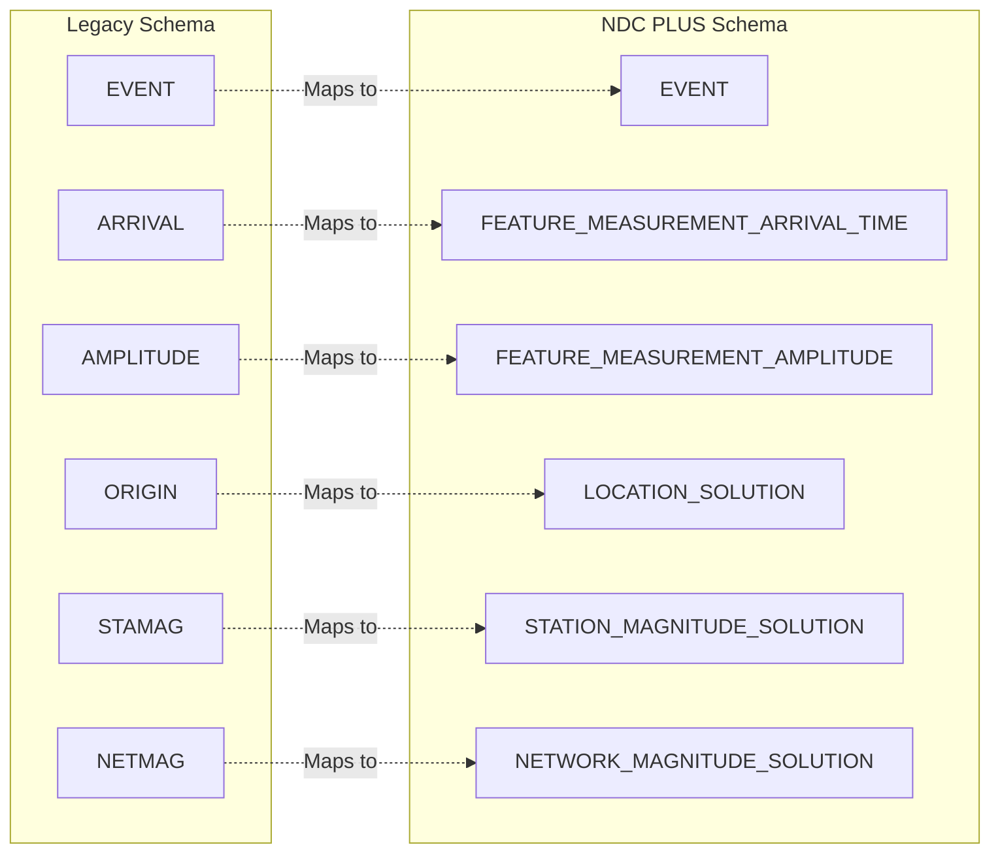
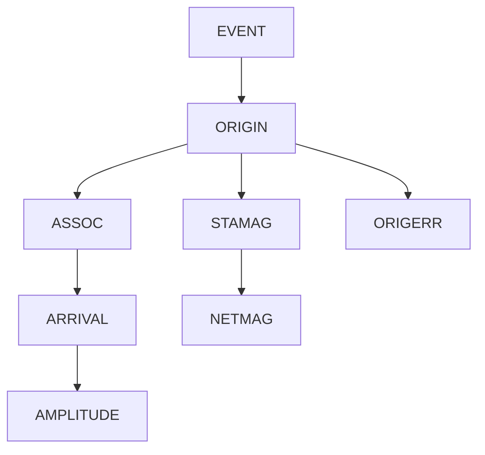
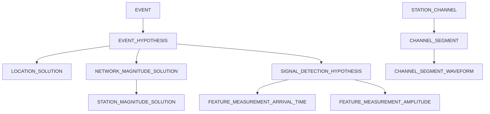

# NDC PLUS and Legacy Database Schema Documentation
## Overview
This documentation covers both the Legacy and NDC PLUS database schemas for seismic event monitoring, waveform analysis, and location determination. Both are Oracle database schemas with distinct but related purposes.

## Schema Comparison
| Aspect | Legacy Schema | NDC PLUS Schema |
|--------|---------------|------------------|
| Tables | 17 tables | 35 tables |
| Focus | Traditional seismic analysis | Modern event processing |
| Data Types | Standard Oracle types | Enhanced with RAW/UUID |
| Relationships | ID-based foreign keys | UUID-based references |

## Cross-Schema Integration
The Legacy and NDC PLUS schemas are designed to work together, with conceptual mappings between related tables:

## Legacy Schema
### Overview
The Legacy schema represents the traditional seismic monitoring database design, optimized for classical seismic analysis workflows.

### Legacy Table Categories
#### Event Management
- **EVENT**: Seismic event master records
- **EVENT_CONTROL**: Event processing control parameters
- **EVENT_CORRELATION**: Cross-correlation analysis of events

#### Arrival & Measurements
- **ARRIVAL**: Seismic phase arrival information
- **ARRIVAL_DYN_PARS_INT**: Dynamic parameters for arrival calculations
- **AMPLITUDE**: Seismic signal amplitude measurements
- **AMPLITUDE_DYN_PARS_INT**: Dynamic parameters for amplitude calculations

#### Location Analysis
- **ORIGIN**: Seismic event origin solutions
- **ORIGERR**: Origin location error estimates
- **ASSOC**: Associations between arrivals and origins

#### Magnitude Calculations
- **STAMAG**: Station magnitude calculations
- **NETMAG**: Network magnitude calculations

#### Quality Control
- **QCMASKINFO**: Quality control mask information

#### Metadata & Tags
- **ACTIVE_ID**: Active identification tags and metadata
- **WFTAG**: Waveform tag associations
- **AR_INFO**: Autoregressive model information
- **REMARK**: Comments and annotations

### Legacy Schema Relationships

## NDC PLUS Schema
### Overview
The NDC PLUS schema represents the modern, enhanced seismic monitoring database design, featuring UUID-based relationships and advanced processing capabilities.

### NDC PLUS Table Categories
#### Channel & Waveform Data
- **CHANNEL_SEGMENT**: Stores time series channel segment information for waveform data
- **CHANNEL_SEGMENT_CREATION**: Tracks creation metadata for channel segments
- **CHANNEL_SEGMENT_PROC_MASK_XREF**: Cross-reference between channel segments and processing masks
- **CHANNEL_SEGMENT_WAVEFORM**: Links channel segments to waveform IDs
- **STATION_CHANNEL**: Station and channel configuration metadata

#### Event Management
- **EVENT**: Seismic event master table
- **EVENT_HYPOTHESIS**: Hypotheses about seismic event characteristics
- **EVENT_HYPOTHESIS_TAG**: Tags and classifications for event hypotheses
- **EVENT_STATUS_INFO**: Status and workflow information for events
- **EVENT_CORRELATION**: Correlation analysis between seismic events

#### Feature Measurements
- **FEATURE_MEASUREMENT_AMPLITUDE**: Amplitude measurements from seismic signals
- **FEATURE_MEASUREMENT_ARRIVAL_TIME**: Arrival time measurements for seismic phases
- **FEATURE_MEASUREMENT_ENUMERATED**: Categorical feature measurements
- **FEATURE_MEASUREMENT_NUMERIC**: Numeric feature measurements

#### Feature Predictions
- **FEATURE_PREDICTION_ARRIVAL_TIME**: Predicted arrival times for seismic phases
- **FEATURE_PREDICTION_COMPONENT**: Component-specific feature predictions
- **FEATURE_PREDICTION_NUMERIC**: Numeric feature predictions

#### Location & Uncertainty
- **LOCATION_SOLUTION**: Calculated geographic locations for events
- **LOCATION_BEHAVIOR**: Location calculation behavior and parameters
- **LOCATION_RESTRAINT**: Constraints and restraints for location calculations
- **LOCATION_UNCERTAINTY**: Uncertainty estimates for event locations
- **LOCATION_UNCERTAINTY_ELLIPSE**: Elliptical uncertainty representation
- **LOCATION_UNCERTAINTY_ELLIPSOID**: Ellipsoidal 3D uncertainty representation

#### Magnitude Calculations
- **NETWORK_MAGNITUDE_SOLUTION**: Network-level magnitude calculations
- **STATION_MAGNITUDE_SOLUTION**: Station-level magnitude calculations

#### Quality Control
- **PROCESSING_MASK**: Data quality masks and processing intervals
- **PROCESSING_MASK_QC_SEGMENT_VERSION**: Links processing masks to QC segments
- **QC_SEGMENT_VERSION**: Quality control segment versions

#### Signal Detection
- **SIGNAL_DETECTION_HYPOTHESIS**: Signal detection hypotheses and picks
- **INTERVAL**: Time intervals for processing and analysis

#### Metadata & Configuration
- **STATION_GROUP_VERSION**: Station group definitions and versions
- **RESPONSE_TABLE**: Instrument response specifications
- **REMARK**: Comments and annotations
- **STAGE_METRICS**: Performance metrics for processing stages

### NDC PLUS Schema Relationships

## Detailed Table Specifications

### Legacy Schema Tables

#### ACTIVE_ID
**Description**: Active identification tags and metadata

**Column Count**: 6

| Column | Type | Nullable | Primary Key |
|--------|------|----------|-------------|
| TAGNAME | VARCHAR2(8) | Yes | No |
| TAGID | NUMBER(18) | No | Yes |
| CLIENT_INFO | VARCHAR2(64) | Yes | No |
| AUTHOR | VARCHAR2(64) | Yes | No |
| MODDATE | DATE | Yes | No |
| LDDATE | DATE | Yes | No |

---

#### AMPLITUDE
**Description**: Seismic signal amplitude measurements

**Column Count**: 17

| Column | Type | Nullable | Primary Key |
|--------|------|----------|-------------|
| AMPID | NUMBER(18) | No | Yes |
| ARID | NUMBER(18) | No | Yes |
| PARID | NUMBER(18) | Yes | No |
| CHAN | VARCHAR2(8) | Yes | No |
| AMP | FLOAT(24) | Yes | No |
| PER | FLOAT(24) | Yes | No |
| SNR | FLOAT(24) | Yes | No |
| AMPTIME | FLOAT(53) | Yes | No |
| TIME | FLOAT(53) | Yes | No |
| DURATION | FLOAT(24) | Yes | No |
| DELTAF | FLOAT(24) | Yes | No |
| AMPTYPE | VARCHAR2(8) | Yes | No |
| UNITS | VARCHAR2(15) | Yes | No |
| CLIP | VARCHAR2(1) | Yes | No |
| INARRIVAL | VARCHAR2(1) | Yes | No |
| AUTH | VARCHAR2(15) | Yes | No |
| LDDATE | DATE | Yes | No |

---

#### AMPLITUDE_DYN_PARS_INT
**Description**: Dynamic parameters for amplitude calculations

**Column Count**: 5

| Column | Type | Nullable | Primary Key |
|--------|------|----------|-------------|
| AMPID | NUMBER(18) | No | Yes |
| GROUP_NAME | VARCHAR2(48) | Yes | No |
| PARAM_NAME | VARCHAR2(48) | Yes | No |
| I_VALUE | NUMBER(18) | Yes | No |
| LDDATE | DATE | Yes | No |

---

#### ARRIVAL
**Description**: Seismic phase arrival information

**Column Count**: 26

| Column | Type | Nullable | Primary Key |
|--------|------|----------|-------------|
| STA | VARCHAR2(6) | Yes | No |
| TIME | FLOAT(53) | Yes | No |
| ARID | NUMBER(18) | No | Yes |
| JDATE | NUMBER(8) | Yes | No |
| STASSID | NUMBER(18) | Yes | No |
| CHANID | NUMBER(18) | Yes | No |
| CHAN | VARCHAR2(8) | Yes | No |
| IPHASE | VARCHAR2(8) | Yes | No |
| STYPE | VARCHAR2(1) | Yes | No |
| DELTIM | FLOAT(24) | Yes | No |
| AZIMUTH | FLOAT(24) | Yes | No |
| DELAZ | FLOAT(24) | Yes | No |
| SLOW | FLOAT(24) | Yes | No |
| DELSLO | FLOAT(24) | Yes | No |
| EMA | FLOAT(24) | Yes | No |
| RECT | FLOAT(24) | Yes | No |
| AMP | FLOAT(24) | Yes | No |
| PER | FLOAT(24) | Yes | No |
| LOGAT | FLOAT(24) | Yes | No |
| CLIP | VARCHAR2(1) | Yes | No |
| FM | VARCHAR2(2) | Yes | No |
| SNR | FLOAT(24) | Yes | No |
| QUAL | VARCHAR2(1) | Yes | No |
| AUTH | VARCHAR2(15) | Yes | No |
| COMMID | NUMBER(18) | No | Yes |
| LDDATE | DATE | Yes | No |

---

#### ARRIVAL_DYN_PARS_INT
**Description**: Dynamic parameters for arrival calculations

**Column Count**: 5

| Column | Type | Nullable | Primary Key |
|--------|------|----------|-------------|
| ARID | NUMBER(18) | No | Yes |
| GROUP_NAME | VARCHAR2(48) | Yes | No |
| PARAM_NAME | VARCHAR2(48) | Yes | No |
| I_VALUE | NUMBER(18) | Yes | No |
| LDDATE | DATE | Yes | No |

---

#### AR_INFO
**Description**: Autoregressive model information

**Column Count**: 29

| Column | Type | Nullable | Primary Key |
|--------|------|----------|-------------|
| ORID | NUMBER(18) | No | Yes |
| ARID | NUMBER(18) | No | Yes |
| TIME_ERROR_CODE | NUMBER(9) | Yes | No |
| AZ_ERROR_CODE | NUMBER(9) | Yes | No |
| SLOW_ERROR_CODE | NUMBER(9) | Yes | No |
| SRC_DPNT_CORR_TYPE | NUMBER(9) | Yes | No |
| VMODEL | VARCHAR2(16) | Yes | No |
| TOTAL_TRAVEL_TIME | FLOAT(24) | Yes | No |
| TT_TABLE_VALUE | FLOAT(24) | Yes | No |
| ELLIP_CORR | FLOAT(24) | Yes | No |
| ELEV_CORR | FLOAT(24) | Yes | No |
| BULK_STATIC_STA_CORR | FLOAT(24) | Yes | No |
| TT_SRC_DPNT_CORR | FLOAT(24) | Yes | No |
| TT_MODEL_ERROR | FLOAT(24) | Yes | No |
| TT_MEAS_ERROR | FLOAT(24) | Yes | No |
| TT_MODEL_PLUS_MEAS_ERROR | FLOAT(24) | Yes | No |
| AZ_SRC_DPNT_CORR | FLOAT(24) | Yes | No |
| AZ_MODEL_ERROR | FLOAT(24) | Yes | No |
| AZ_MEAS_ERROR | FLOAT(24) | Yes | No |
| AZ_MODEL_PLUS_MEAS_ERROR | FLOAT(24) | Yes | No |
| SL_SRC_DPNT_CORR | FLOAT(24) | Yes | No |
| SL_MODEL_ERROR | FLOAT(24) | Yes | No |
| SL_MEAS_ERROR | FLOAT(24) | Yes | No |
| SL_MODEL_PLUS_MEAS_ERROR | FLOAT(24) | Yes | No |
| TIME_IMPORT | FLOAT(24) | Yes | No |
| AZ_IMPORT | FLOAT(24) | Yes | No |
| SLOW_IMPORT | FLOAT(24) | Yes | No |
| SLOW_VEC_RES | FLOAT(24) | Yes | No |
| LDDATE | DATE | Yes | No |

---

#### ASSOC
**Description**: Associations between arrivals and origins

**Column Count**: 19

| Column | Type | Nullable | Primary Key |
|--------|------|----------|-------------|
| ARID | NUMBER(18) | No | Yes |
| ORID | NUMBER(18) | No | Yes |
| STA | VARCHAR2(6) | Yes | No |
| PHASE | VARCHAR2(8) | Yes | No |
| BELIEF | FLOAT(24) | Yes | No |
| DELTA | FLOAT(24) | Yes | No |
| SEAZ | FLOAT(24) | Yes | No |
| ESAZ | FLOAT(24) | Yes | No |
| TIMERES | FLOAT(24) | Yes | No |
| TIMEDEF | VARCHAR2(1) | Yes | No |
| AZRES | FLOAT(24) | Yes | No |
| AZDEF | VARCHAR2(1) | Yes | No |
| SLORES | FLOAT(24) | Yes | No |
| SLODEF | VARCHAR2(1) | Yes | No |
| EMARES | FLOAT(24) | Yes | No |
| WGT | FLOAT(24) | Yes | No |
| VMODEL | VARCHAR2(15) | Yes | No |
| COMMID | NUMBER(18) | No | Yes |
| LDDATE | DATE | Yes | No |

---

#### EVENT
**Description**: Seismic event master records

**Column Count**: 6

| Column | Type | Nullable | Primary Key |
|--------|------|----------|-------------|
| EVID | NUMBER(18) | No | Yes |
| EVNAME | VARCHAR2(32) | Yes | No |
| PREFOR | NUMBER(18) | Yes | No |
| AUTH | VARCHAR2(15) | Yes | No |
| COMMID | NUMBER(18) | No | Yes |
| LDDATE | DATE | Yes | No |

---

#### EVENT_CONTROL
**Description**: Event processing control parameters

**Column Count**: 26

| Column | Type | Nullable | Primary Key |
|--------|------|----------|-------------|
| ORID | NUMBER(18) | No | Yes |
| EVID | NUMBER(18) | No | Yes |
| PREFER_LOC | VARCHAR2(1) | Yes | No |
| CONSTRAIN_OT | NUMBER(1) | Yes | No |
| CONSTRAIN_LATLON | NUMBER(1) | Yes | No |
| CONSTRAIN_DEPTH | NUMBER(1) | Yes | No |
| SRC_DPNT_CORR | NUMBER(2) | Yes | No |
| LOC_SRC_DPNT_REG | VARCHAR2(15) | Yes | No |
| LOC_SDV_SCREEN | NUMBER(1) | Yes | No |
| LOC_SDV_MULT | FLOAT(24) | Yes | No |
| LOC_ALPHA_ONLY | NUMBER(1) | Yes | No |
| LOC_ALL_STAS | NUMBER(1) | Yes | No |
| LOC_DIST_VARWGT | NUMBER(1) | Yes | No |
| LOC_USER_VARWGT | FLOAT(24) | Yes | No |
| MAG_SRC_DPNT_REG | VARCHAR2(15) | Yes | No |
| MAG_SDV_SCREEN | NUMBER(1) | Yes | No |
| MAG_SDV_MULT | FLOAT(24) | Yes | No |
| MAG_ALPHA_ONLY | NUMBER(1) | Yes | No |
| MAG_ALL_STAS | NUMBER(1) | Yes | No |
| MB_MIN_DIST | FLOAT(24) | Yes | No |
| MB_MAX_DIST | FLOAT(24) | Yes | No |
| MMODEL | VARCHAR2(15) | Yes | No |
| COV_SM_AXES | FLOAT(24) | Yes | No |
| COV_DEPTH_TIME | FLOAT(24) | Yes | No |
| OBS_CORR_METHOD | NUMBER(1) | Yes | No |
| LDDATE | DATE | Yes | No |

---

#### EVENT_CORRELATION
**Description**: Cross-correlation analysis of events

**Column Count**: 19

| Column | Type | Nullable | Primary Key |
|--------|------|----------|-------------|
| CORR_ID | NUMBER(18) | Yes | No |
| SOURCE_ORID | NUMBER(18) | Yes | No |
| SOURCE_EVID | NUMBER(18) | Yes | No |
| SOURCE_STARTTIME | FLOAT(53) | Yes | No |
| SOURCE_SECS | FLOAT(53) | Yes | No |
| REFERENCE_ORID | NUMBER(18) | Yes | No |
| REFERENCE_EVID | NUMBER(18) | Yes | No |
| REFERENCE_STARTTIME | FLOAT(53) | Yes | No |
| REFERENCE_SECS | FLOAT(53) | Yes | No |
| STA | VARCHAR2(6) | Yes | No |
| FILTER_STRING | VARCHAR2(2000) | Yes | No |
| NUM_CHAN | NUMBER(9) | Yes | No |
| CHAN_LIST | VARCHAR2(2000) | Yes | No |
| CORR_COEF | FLOAT(53) | Yes | No |
| CORR_TIME | FLOAT(53) | Yes | No |
| SCAN_TYPE | VARCHAR2(32) | Yes | No |
| AUTHOR | VARCHAR2(64) | Yes | No |
| MODDATE | DATE | Yes | No |
| LDDATE | DATE | Yes | No |

---

#### NETMAG
**Description**: Network magnitude calculations

**Column Count**: 11

| Column | Type | Nullable | Primary Key |
|--------|------|----------|-------------|
| MAGID | NUMBER(18) | No | Yes |
| NET | VARCHAR2(8) | Yes | No |
| ORID | NUMBER(18) | No | Yes |
| EVID | NUMBER(18) | No | Yes |
| MAGTYPE | VARCHAR2(6) | Yes | No |
| NSTA | NUMBER(8) | Yes | No |
| MAGNITUDE | FLOAT(24) | Yes | No |
| UNCERTAINTY | FLOAT(24) | Yes | No |
| AUTH | VARCHAR2(15) | Yes | No |
| COMMID | NUMBER(18) | No | Yes |
| LDDATE | DATE | Yes | No |

---

#### ORIGERR
**Description**: Origin location error estimates

**Column Count**: 20

| Column | Type | Nullable | Primary Key |
|--------|------|----------|-------------|
| ORID | NUMBER(18) | No | Yes |
| SXX | FLOAT(24) | Yes | No |
| SYY | FLOAT(24) | Yes | No |
| SZZ | FLOAT(24) | Yes | No |
| STT | FLOAT(24) | Yes | No |
| SXY | FLOAT(24) | Yes | No |
| SXZ | FLOAT(24) | Yes | No |
| SYZ | FLOAT(24) | Yes | No |
| STX | FLOAT(24) | Yes | No |
| STY | FLOAT(24) | Yes | No |
| STZ | FLOAT(24) | Yes | No |
| SDOBS | FLOAT(24) | Yes | No |
| SMAJAX | FLOAT(24) | Yes | No |
| SMINAX | FLOAT(24) | Yes | No |
| STRIKE | FLOAT(24) | Yes | No |
| SDEPTH | FLOAT(24) | Yes | No |
| STIME | FLOAT(24) | Yes | No |
| CONF | FLOAT(24) | Yes | No |
| COMMID | NUMBER(18) | No | Yes |
| LDDATE | DATE | Yes | No |

---

#### ORIGIN
**Description**: Seismic event origin solutions

**Column Count**: 25

| Column | Type | Nullable | Primary Key |
|--------|------|----------|-------------|
| LAT | FLOAT(24) | Yes | No |
| LON | FLOAT(24) | Yes | No |
| DEPTH | FLOAT(24) | Yes | No |
| TIME | FLOAT(53) | Yes | No |
| ORID | NUMBER(18) | No | Yes |
| EVID | NUMBER(18) | No | Yes |
| JDATE | NUMBER(8) | Yes | No |
| NASS | NUMBER(4) | Yes | No |
| NDEF | NUMBER(4) | Yes | No |
| NDP | NUMBER(4) | Yes | No |
| GRN | NUMBER(8) | Yes | No |
| SRN | NUMBER(8) | Yes | No |
| ETYPE | VARCHAR2(7) | Yes | No |
| DEPDP | FLOAT(24) | Yes | No |
| DTYPE | VARCHAR2(1) | Yes | No |
| MB | FLOAT(24) | Yes | No |
| MBID | NUMBER(18) | Yes | No |
| MS | FLOAT(24) | Yes | No |
| MSID | NUMBER(18) | Yes | No |
| ML | FLOAT(24) | Yes | No |
| MLID | NUMBER(18) | Yes | No |
| ALGORITHM | VARCHAR2(15) | Yes | No |
| AUTH | VARCHAR2(15) | Yes | No |
| COMMID | NUMBER(18) | No | Yes |
| LDDATE | DATE | Yes | No |

---

#### QCMASKINFO
**Description**: Quality control mask information

**Column Count**: 10

| Column | Type | Nullable | Primary Key |
|--------|------|----------|-------------|
| QCMASKID | NUMBER(18) | No | Yes |
| STA | VARCHAR2(6) | Yes | No |
| CHAN | VARCHAR2(8) | Yes | No |
| TIME | FLOAT(53) | Yes | No |
| ENDTIME | FLOAT(53) | Yes | No |
| SAMPRATE | FLOAT(24) | Yes | No |
| NSEG | NUMBER(8) | Yes | No |
| QCDEFID | NUMBER(18) | Yes | No |
| AUTH | VARCHAR2(15) | Yes | No |
| LDDATE | DATE | Yes | No |

---

#### REMARK
**Description**: Comments and annotations

**Column Count**: 4

| Column | Type | Nullable | Primary Key |
|--------|------|----------|-------------|
| COMMID | NUMBER(18) | No | Yes |
| LINENO | NUMBER(8) | Yes | No |
| REMARK | VARCHAR2(160) | Yes | No |
| LDDATE | DATE | Yes | No |

---

#### STAMAG
**Description**: Station magnitude calculations

**Column Count**: 17

| Column | Type | Nullable | Primary Key |
|--------|------|----------|-------------|
| MAGID | NUMBER(18) | No | Yes |
| AMPID | NUMBER(18) | No | Yes |
| STA | VARCHAR2(6) | Yes | No |
| ARID | NUMBER(18) | No | Yes |
| ORID | NUMBER(18) | No | Yes |
| EVID | NUMBER(18) | No | Yes |
| PHASE | VARCHAR2(8) | Yes | No |
| DELTA | FLOAT(24) | Yes | No |
| MAGTYPE | VARCHAR2(6) | Yes | No |
| MAGNITUDE | FLOAT(24) | Yes | No |
| UNCERTAINTY | FLOAT(24) | Yes | No |
| MAGRES | FLOAT(24) | Yes | No |
| MAGDEF | VARCHAR2(1) | Yes | No |
| MMODEL | VARCHAR2(15) | Yes | No |
| AUTH | VARCHAR2(15) | Yes | No |
| COMMID | NUMBER(18) | No | Yes |
| LDDATE | DATE | Yes | No |

---

#### WFTAG
**Description**: Waveform tag associations

**Column Count**: 4

| Column | Type | Nullable | Primary Key |
|--------|------|----------|-------------|
| TAGNAME | VARCHAR2(8) | Yes | No |
| TAGID | NUMBER(18) | No | Yes |
| WFID | NUMBER(18) | No | Yes |
| LDDATE | DATE | Yes | No |

---

### NDC PLUS Schema Tables

#### CHANNEL_SEGMENT
**Description**: Stores time series channel segment information for waveform data

**Column Count**: 10

| Column | Type | Nullable | Primary Key |
|--------|------|----------|-------------|
| UUID | NOT NULL RAW(16) | Yes | No |
| CHANNEL_SEGMENT_CREATION_UUID | RAW(16) | Yes | No |
| REFERENCE_ID | RAW(16) | Yes | No |
| CREATION_TIME | TIMESTAMP(6) | Yes | No |
| CHAN_CANONICAL_NAME | VARCHAR2(32) | Yes | No |
| CHAN_EFFECTIVE_AT | TIMESTAMP(6) | Yes | No |
| TIME_SERIES_TYPE | VARCHAR2(32) | Yes | No |
| START_TIME | TIMESTAMP(6) | Yes | No |
| END_TIME | TIMESTAMP(6) | Yes | No |
| LDDATE | TIMESTAMP(6) | Yes | No |

---

#### CHANNEL_SEGMENT_CREATION
**Description**: Tracks creation metadata for channel segments

**Column Count**: 3

| Column | Type | Nullable | Primary Key |
|--------|------|----------|-------------|
| UUID | NOT NULL RAW(16) | Yes | No |
| OBJECT | CLOB | Yes | No |
| LDDATE | TIMESTAMP(6) | Yes | No |

---

#### CHANNEL_SEGMENT_PROC_MASK_XREF
**Description**: Cross-reference between channel segments and processing masks

**Column Count**: 6

| Column | Type | Nullable | Primary Key |
|--------|------|----------|-------------|
| UUID | NOT NULL RAW(16) | Yes | No |
| CHANNEL_SEGMENT_UUID | RAW(16) | Yes | No |
| PROCESSING_MASK_UUID | RAW(16) | Yes | No |
| ISCURRENT | VARCHAR2(1) | Yes | No |
| MODDATE | TIMESTAMP(6) | Yes | No |
| LDDATE | TIMESTAMP(6) | Yes | No |

---

#### CHANNEL_SEGMENT_WAVEFORM
**Description**: Links channel segments to waveform IDs

**Column Count**: 6

| Column | Type | Nullable | Primary Key |
|--------|------|----------|-------------|
| UUID | NOT NULL RAW(16) | Yes | No |
| CHANNEL_SEGMENT_UUID | RAW(16) | Yes | No |
| WFID | NUMBER(18) | Yes | No |
| ISCURRENT | VARCHAR2(1) | Yes | No |
| MODDATE | TIMESTAMP(6) | Yes | No |
| LDDATE | TIMESTAMP(6) | Yes | No |

---

#### EVENT
**Description**: Seismic event master table

**Column Count**: 4

| Column | Type | Nullable | Primary Key |
|--------|------|----------|-------------|
| UUID | NOT NULL RAW(16) | Yes | No |
| REMARK_GID | RAW(16) | Yes | No |
| MONITORING_ORGANIZATION | VARCHAR2(32) | Yes | No |
| LDDATE | TIMESTAMP(6) | Yes | No |

---

#### EVENT_CORRELATION
**Description**: Correlation analysis between seismic events

**Column Count**: 17

| Column | Type | Nullable | Primary Key |
|--------|------|----------|-------------|
| UUID | NOT NULL RAW(16) | Yes | No |
| SOURCE_EVENT_HYPOTHESIS_UUID | RAW(16) | Yes | No |
| SIMILAR_EVENT_HYPOTHESIS_UUID | RAW(16) | Yes | No |
| SOURCE_EVENT_CHANNEL_SEGMENT_GID | RAW(16) | Yes | No |
| SIMILAR_EVENT_CHANNEL_SEGMENT_GID | RAW(16) | Yes | No |
| STA_NAME | VARCHAR2(6) | Yes | No |
| STA_EFFECTIVE_AT | TIMESTAMP(6) | Yes | No |
| CHAN_LIST | VARCHAR2(2000) | Yes | No |
| FILTERID | NUMBER(18) | Yes | No |
| SCAN_TYPE | VARCHAR2(32) | Yes | No |
| SCAN_STAGES | VARCHAR2(32) | Yes | No |
| CORRELATION_COEFFICIENT | BINARY_FLOAT | Yes | No |
| AUTHOR | VARCHAR2(32) | Yes | No |
| STAGE | VARCHAR2(32) | Yes | No |
| ISCURRENT | VARCHAR2(1) | Yes | No |
| MODDATE | TIMESTAMP(6) | Yes | No |
| LDDATE | TIMESTAMP(6) | Yes | No |

---

#### EVENT_CORRELATION_CHANNEL_SEGMENT
**Description**: Channel segments used in event correlation

**Column Count**: 8

| Column | Type | Nullable | Primary Key |
|--------|------|----------|-------------|
| UUID | NOT NULL RAW(16) | Yes | No |
| CHANNEL_SEGMENT_GID | NOT NULL RAW(16) | Yes | No |
| CHAN_CANONICAL_NAME | VARCHAR2(32) | Yes | No |
| CHAN_EFFECTIVE_AT | TIMESTAMP(6) | Yes | No |
| TIME_SERIES_TYPE | VARCHAR2(32) | Yes | No |
| START_TIME | TIMESTAMP(6) | Yes | No |
| END_TIME | TIMESTAMP(6) | Yes | No |
| LDDATE | TIMESTAMP(6) | Yes | No |

---

#### EVENT_HYPOTHESIS
**Description**: Hypotheses about seismic event characteristics

**Column Count**: 12

| Column | Type | Nullable | Primary Key |
|--------|------|----------|-------------|
| UUID | NOT NULL RAW(16) | Yes | No |
| EVENT_UUID | RAW(16) | Yes | No |
| PREFERRED_LOCATION_SOLUTION_UUID | RAW(16) | Yes | No |
| REMARK_GID | RAW(16) | Yes | No |
| DELETED | VARCHAR2(1) | Yes | No |
| REJECTED | VARCHAR2(1) | Yes | No |
| PREFERRED_BY | VARCHAR2(32) | Yes | No |
| AUTHOR | VARCHAR2(32) | Yes | No |
| STAGE | VARCHAR2(32) | Yes | No |
| ISCURRENT | VARCHAR2(1) | Yes | No |
| MODDATE | TIMESTAMP(6) | Yes | No |
| LDDATE | TIMESTAMP(6) | Yes | No |

---

#### EVENT_HYPOTHESIS_TAG
**Description**: Tags and classifications for event hypotheses

**Column Count**: 8

| Column | Type | Nullable | Primary Key |
|--------|------|----------|-------------|
| UUID | NOT NULL RAW(16) | Yes | No |
| EVENT_HYPOTHESIS_UUID | NOT NULL RAW(16) | Yes | No |
| TAG | VARCHAR2(32) | Yes | No |
| AUTHOR | VARCHAR2(32) | Yes | No |
| STAGE | VARCHAR2(32) | Yes | No |
| ISCURRENT | VARCHAR2(1) | Yes | No |
| MODDATE | TIMESTAMP(6) | Yes | No |
| LDDATE | TIMESTAMP(6) | Yes | No |

---

#### EVENT_STATUS_INFO
**Description**: Status and workflow information for events

**Column Count**: 8

| Column | Type | Nullable | Primary Key |
|--------|------|----------|-------------|
| UUID | NOT NULL RAW(16) | Yes | No |
| EVENT_UUID | RAW(16) | Yes | No |
| EVENT_STATUS | VARCHAR2(16) | Yes | No |
| ACTIVE_ANALYST_IDS | VARCHAR2(256) | Yes | No |
| STAGE | VARCHAR2(32) | Yes | No |
| ISCURRENT | VARCHAR2(1) | Yes | No |
| MODDATE | TIMESTAMP(6) | Yes | No |
| LDDATE | TIMESTAMP(6) | Yes | No |

---

#### FEATURE_MEASUREMENT_AMPLITUDE
**Description**: Amplitude measurements from seismic signals

**Column Count**: 18

| Column | Type | Nullable | Primary Key |
|--------|------|----------|-------------|
| UUID | NOT NULL RAW(16) | Yes | No |
| SIG_DET_HYPO_GID | RAW(16) | Yes | No |
| MEASURED_CHANNEL_SEGMENT_UUID | RAW(16) | Yes | No |
| ANALYSIS_CHANNEL_SEGMENT_UUID | RAW(16) | Yes | No |
| FILTERID | NUMBER(18) | Yes | No |
| FILTER_USAGE | VARCHAR2(32) | Yes | No |
| CHAN_CANONICAL_NAME | VARCHAR2(32) | Yes | No |
| CHAN_EFFECTIVE_AT | TIMESTAMP(6) | Yes | No |
| MEASUREMENT_TYPE | VARCHAR2(20) | Yes | No |
| AMPLITUDE | BINARY_FLOAT | Yes | No |
| PERIOD | BINARY_FLOAT | Yes | No |
| UNITS | VARCHAR2(32) | Yes | No |
| CLIPPED | VARCHAR2(1) | Yes | No |
| MEASUREMENT_WINDOW_START_TIME | TIMESTAMP(6) | Yes | No |
| MEASUREMENT_WINDOW_DURATION | BINARY_FLOAT | Yes | No |
| MEASUREMENT_TIME | TIMESTAMP(6) | Yes | No |
| SNR | BINARY_FLOAT | Yes | No |
| LDDATE | TIMESTAMP(6) | Yes | No |

---

#### FEATURE_MEASUREMENT_ARRIVAL_TIME
**Description**: Arrival time measurements for seismic phases

**Column Count**: 13

| Column | Type | Nullable | Primary Key |
|--------|------|----------|-------------|
| UUID | NOT NULL RAW(16) | Yes | No |
| SIG_DET_HYPO_GID | RAW(16) | Yes | No |
| MEASURED_CHANNEL_SEGMENT_UUID | RAW(16) | Yes | No |
| ANALYSIS_CHANNEL_SEGMENT_UUID | RAW(16) | Yes | No |
| FILTERID | NUMBER(18) | Yes | No |
| FILTER_USAGE | VARCHAR2(32) | Yes | No |
| CHAN_CANONICAL_NAME | VARCHAR2(32) | Yes | No |
| CHAN_EFFECTIVE_AT | TIMESTAMP(6) | Yes | No |
| MEASUREMENT_TYPE | VARCHAR2(27) | Yes | No |
| ARRIVAL_TIME | TIMESTAMP(6) | Yes | No |
| STANDARD_DEVIATION | BINARY_FLOAT | Yes | No |
| SNR | BINARY_FLOAT | Yes | No |
| LDDATE | TIMESTAMP(6) | Yes | No |

---

#### FEATURE_MEASUREMENT_ENUMERATED
**Description**: Categorical feature measurements

**Column Count**: 14

| Column | Type | Nullable | Primary Key |
|--------|------|----------|-------------|
| UUID | NOT NULL RAW(16) | Yes | No |
| SIG_DET_HYPO_GID | RAW(16) | Yes | No |
| MEASURED_CHANNEL_SEGMENT_UUID | RAW(16) | Yes | No |
| ANALYSIS_CHANNEL_SEGMENT_UUID | RAW(16) | Yes | No |
| FILTERID | NUMBER(18) | Yes | No |
| FILTER_USAGE | VARCHAR2(32) | Yes | No |
| CHAN_CANONICAL_NAME | VARCHAR2(32) | Yes | No |
| CHAN_EFFECTIVE_AT | TIMESTAMP(6) | Yes | No |
| MEASUREMENT_TYPE | VARCHAR2(20) | Yes | No |
| MEASURED_VALUE | VARCHAR2(13) | Yes | No |
| CONFIDENCE | BINARY_FLOAT | Yes | No |
| REFERENCE_TIME | TIMESTAMP(6) | Yes | No |
| SNR | BINARY_FLOAT | Yes | No |
| LDDATE | TIMESTAMP(6) | Yes | No |

---

#### FEATURE_MEASUREMENT_NUMERIC
**Description**: Numeric feature measurements

**Column Count**: 15

| Column | Type | Nullable | Primary Key |
|--------|------|----------|-------------|
| UUID | NOT NULL RAW(16) | Yes | No |
| SIG_DET_HYPO_GID | RAW(16) | Yes | No |
| MEASURED_CHANNEL_SEGMENT_UUID | RAW(16) | Yes | No |
| ANALYSIS_CHANNEL_SEGMENT_UUID | RAW(16) | Yes | No |
| FILTERID | NUMBER(18) | Yes | No |
| FILTER_USAGE | VARCHAR2(32) | Yes | No |
| CHAN_CANONICAL_NAME | VARCHAR2(32) | Yes | No |
| CHAN_EFFECTIVE_AT | TIMESTAMP(6) | Yes | No |
| MEASUREMENT_TYPE | VARCHAR2(27) | Yes | No |
| MEASURED_VALUE | BINARY_FLOAT | Yes | No |
| UNITS | VARCHAR2(32) | Yes | No |
| STANDARD_DEVIATION | BINARY_FLOAT | Yes | No |
| REFERENCE_TIME | TIMESTAMP(6) | Yes | No |
| SNR | BINARY_FLOAT | Yes | No |
| LDDATE | TIMESTAMP(6) | Yes | No |

---

#### FEATURE_PREDICTION_ARRIVAL_TIME
**Description**: Predicted arrival times for seismic phases

**Column Count**: 11

| Column | Type | Nullable | Primary Key |
|--------|------|----------|-------------|
| UUID | NOT NULL RAW(16) | Yes | No |
| LOCATION_BEHAVIOR_UUID | RAW(16) | Yes | No |
| CHAN_CANONICAL_NAME | VARCHAR2(32) | Yes | No |
| CHAN_EFFECTIVE_AT | TIMESTAMP(6) | Yes | No |
| PHASE | VARCHAR2(8) | Yes | No |
| PREDICTION_TYPE | VARCHAR2(27) | Yes | No |
| ARRIVAL_TIME | TIMESTAMP(6) | Yes | No |
| TRAVEL_TIME | BINARY_FLOAT | Yes | No |
| STANDARD_DEVIATION | BINARY_FLOAT | Yes | No |
| EXTRAPOLATED | VARCHAR2(1) | Yes | No |
| LDDATE | TIMESTAMP(6) | Yes | No |

---

#### FEATURE_PREDICTION_COMPONENT
**Description**: Component-specific feature predictions

**Column Count**: 6

| Column | Type | Nullable | Primary Key |
|--------|------|----------|-------------|
| UUID | NOT NULL RAW(16) | Yes | No |
| FEATURE_PREDICTION_UUID | RAW(16) | Yes | No |
| PREDICTION_COMPONENT_TYPE | VARCHAR2(35) | Yes | No |
| VALUE | BINARY_FLOAT | Yes | No |
| EXTRAPOLATED | VARCHAR2(1) | Yes | No |
| LDDATE | TIMESTAMP(6) | Yes | No |

---

#### FEATURE_PREDICTION_NUMERIC
**Description**: Numeric feature predictions

**Column Count**: 11

| Column | Type | Nullable | Primary Key |
|--------|------|----------|-------------|
| UUID | NOT NULL RAW(16) | Yes | No |
| LOCATION_BEHAVIOR_UUID | RAW(16) | Yes | No |
| CHAN_CANONICAL_NAME | VARCHAR2(32) | Yes | No |
| CHAN_EFFECTIVE_AT | TIMESTAMP(6) | Yes | No |
| PHASE | VARCHAR2(8) | Yes | No |
| PREDICTION_TYPE | VARCHAR2(27) | Yes | No |
| PREDICTED_VALUE | BINARY_FLOAT | Yes | No |
| UNITS | VARCHAR2(32) | Yes | No |
| STANDARD_DEVIATION | BINARY_FLOAT | Yes | No |
| EXTRAPOLATED | VARCHAR2(1) | Yes | No |
| LDDATE | TIMESTAMP(6) | Yes | No |

---

#### INTERVAL
**Description**: Time intervals for processing and analysis

**Column Count**: 20

| Column | Type | Nullable | Primary Key |
|--------|------|----------|-------------|
| UUID | NOT NULL RAW(16) | Yes | No |
| INTERVAL_GID | RAW(16) | Yes | No |
| REMARK_GID | RAW(16) | Yes | No |
| STATUS | VARCHAR2(16) | Yes | No |
| START_TIME | TIMESTAMP(6) | Yes | No |
| END_TIME | TIMESTAMP(6) | Yes | No |
| PROCESSING_START_TIME | TIMESTAMP(6) | Yes | No |
| PROCESSING_END_TIME | TIMESTAMP(6) | Yes | No |
| PERCENT_COMPLETED | BINARY_FLOAT | Yes | No |
| ACTIVE_ANALYST_IDS | VARCHAR2(256) | Yes | No |
| RESERVED_ANALYST_ID | VARCHAR2(32) | Yes | No |
| COMPLETED_ANALYST_ID | VARCHAR2(32) | Yes | No |
| AUTHOR | VARCHAR2(32) | Yes | No |
| STAGE | VARCHAR2(32) | Yes | No |
| STAGE_MODE | VARCHAR2(32) | Yes | No |
| SUB_STAGE | VARCHAR2(64) | Yes | No |
| LAST_EXECUTED_STEP_NAME | VARCHAR2(32) | Yes | No |
| ISCURRENT | VARCHAR2(1) | Yes | No |
| MODDATE | TIMESTAMP(6) | Yes | No |
| LDDATE | TIMESTAMP(6) | Yes | No |

---

#### LOCATION_BEHAVIOR
**Description**: Location calculation behavior and parameters

**Column Count**: 11

| Column | Type | Nullable | Primary Key |
|--------|------|----------|-------------|
| UUID | NOT NULL RAW(16) | Yes | No |
| LOCATION_SOLUTION_UUID | RAW(16) | Yes | No |
| SIG_DET_HYPO_GID | RAW(16) | Yes | No |
| FEATURE_MEASUREMENT_UUID | RAW(16) | Yes | No |
| FEATURE_PREDICTION_UUID | RAW(16) | Yes | No |
| VALUE_TYPE | VARCHAR2(12) | Yes | No |
| DEFINING | VARCHAR2(1) | Yes | No |
| REQUESTED_DEFINING | VARCHAR2(1) | Yes | No |
| RESIDUAL | BINARY_FLOAT | Yes | No |
| WEIGHT | BINARY_FLOAT | Yes | No |
| LDDATE | TIMESTAMP(6) | Yes | No |

---

#### LOCATION_RESTRAINT
**Description**: Constraints and restraints for location calculations

**Column Count**: 12

| Column | Type | Nullable | Primary Key |
|--------|------|----------|-------------|
| UUID | NOT NULL RAW(16) | Yes | No |
| LOCATION_SOLUTION_UUID | RAW(16) | Yes | No |
| DEPTH_RESTRAINT_TYPE | VARCHAR2(12) | Yes | No |
| DEPTH_RESTRAINT_KM | BINARY_FLOAT | Yes | No |
| DEPTH_RESTRAINT_REASON | VARCHAR2(51) | Yes | No |
| EPICENTER_RESTRAINT_TYPE | VARCHAR2(12) | Yes | No |
| LATITUDE_RESTRAINT_DEG | BINARY_FLOAT | Yes | No |
| LONGITUDE_RESTRAINT_DEG | BINARY_FLOAT | Yes | No |
| TIME_RESTRAINT_TYPE | VARCHAR2(12) | Yes | No |
| TIME_RESTRAINT | TIMESTAMP(6) | Yes | No |
| RESTRAINER | VARCHAR2(22) | Yes | No |
| LDDATE | TIMESTAMP(6) | Yes | No |

---

#### LOCATION_SOLUTION
**Description**: Calculated geographic locations for events

**Column Count**: 15

| Column | Type | Nullable | Primary Key |
|--------|------|----------|-------------|
| UUID | NOT NULL RAW(16) | Yes | No |
| EVENT_HYPOTHESIS_UUID | RAW(16) | Yes | No |
| REMARK_GID | RAW(16) | Yes | No |
| LAT | BINARY_FLOAT | Yes | No |
| LON | BINARY_FLOAT | Yes | No |
| DEPTH | BINARY_FLOAT | Yes | No |
| TIME | TIMESTAMP(6) | Yes | No |
| GRN | NUMBER(8) | Yes | No |
| SRN | NUMBER(8) | Yes | No |
| ALGORITHM | VARCHAR2(15) | Yes | No |
| AUTHOR | VARCHAR2(32) | Yes | No |
| STAGE | VARCHAR2(32) | Yes | No |
| ISCURRENT | VARCHAR2(1) | Yes | No |
| MODDATE | TIMESTAMP(6) | Yes | No |
| LDDATE | TIMESTAMP(6) | Yes | No |

---

#### LOCATION_UNCERTAINTY
**Description**: Uncertainty estimates for event locations

**Column Count**: 18

| Column | Type | Nullable | Primary Key |
|--------|------|----------|-------------|
| UUID | NOT NULL RAW(16) | Yes | No |
| LOCATION_SOLUTION_UUID | RAW(16) | Yes | No |
| REMARK_GID | RAW(16) | Yes | No |
| XX | BINARY_FLOAT | Yes | No |
| YY | BINARY_FLOAT | Yes | No |
| ZZ | BINARY_FLOAT | Yes | No |
| TT | BINARY_FLOAT | Yes | No |
| XY | BINARY_FLOAT | Yes | No |
| XZ | BINARY_FLOAT | Yes | No |
| YZ | BINARY_FLOAT | Yes | No |
| TX | BINARY_FLOAT | Yes | No |
| TY | BINARY_FLOAT | Yes | No |
| TZ | BINARY_FLOAT | Yes | No |
| STD_DEV_TRAVEL_TIME_RESIDUALS | BINARY_FLOAT | Yes | No |
| STAGE | VARCHAR2(32) | Yes | No |
| ISCURRENT | VARCHAR2(1) | Yes | No |
| MODDATE | TIMESTAMP(6) | Yes | No |
| LDDATE | TIMESTAMP(6) | Yes | No |

---

#### LOCATION_UNCERTAINTY_ELLIPSE
**Description**: Elliptical uncertainty representation

**Column Count**: 12

| Column | Type | Nullable | Primary Key |
|--------|------|----------|-------------|
| UUID | NOT NULL RAW(16) | Yes | No |
| LOCATION_UNCERTAINTY_UUID | RAW(16) | Yes | No |
| SCALING_FACTOR_TYPE | VARCHAR2(32) | Yes | No |
| K_WEIGHT | BINARY_FLOAT | Yes | No |
| CONFIDENCE_LEVEL | BINARY_FLOAT | Yes | No |
| APRIORI_VARIANCE | BINARY_FLOAT | Yes | No |
| SEMI_MAJOR_AXIS_LENGTH_KM | BINARY_FLOAT | Yes | No |
| SEMI_MAJOR_AXIS_TREND_DEG | BINARY_FLOAT | Yes | No |
| SEMI_MINOR_AXIS_LENGTH_KM | BINARY_FLOAT | Yes | No |
| DEPTH_UNCERTAINTY_KM | BINARY_FLOAT | Yes | No |
| TIME_UNCERTAINTY | BINARY_FLOAT | Yes | No |
| LDDATE | TIMESTAMP(6) | Yes | No |

---

#### LOCATION_UNCERTAINTY_ELLIPSOID
**Description**: Ellipsoidal 3D uncertainty representation

**Column Count**: 17

| Column | Type | Nullable | Primary Key |
|--------|------|----------|-------------|
| UUID | NOT NULL RAW(16) | Yes | No |
| LOCATION_UNCERTAINTY_UUID | RAW(16) | Yes | No |
| SCALING_FACTOR_TYPE | VARCHAR2(32) | Yes | No |
| K_WEIGHT | BINARY_FLOAT | Yes | No |
| CONFIDENCE_LEVEL | BINARY_FLOAT | Yes | No |
| APRIORI_VARIANCE | BINARY_FLOAT | Yes | No |
| SEMI_MAJOR_AXIS_LENGTH_KM | BINARY_FLOAT | Yes | No |
| SEMI_MAJOR_AXIS_TREND_DEG | BINARY_FLOAT | Yes | No |
| SEMI_MAJOR_AXIS_PLUNGE_DEG | BINARY_FLOAT | Yes | No |
| SEMI_INTERMEDIATE_AXIS_LENGTH_KM | BINARY_FLOAT | Yes | No |
| SEMI_INTERMEDIATE_AXIS_TREND_DEG | BINARY_FLOAT | Yes | No |
| SEMI_INTERMEDIATE_AXIS_PLUNGE_DEG | BINARY_FLOAT | Yes | No |
| SEMI_MINOR_AXIS_LENGTH_KM | BINARY_FLOAT | Yes | No |
| SEMI_MINOR_AXIS_TREND_KM | BINARY_FLOAT | Yes | No |
| SEMI_MINOR_AXIS_PLUNGE_KM | BINARY_FLOAT | Yes | No |
| TIME_UNCERTAINTY | BINARY_FLOAT | Yes | No |
| LDDATE | TIMESTAMP(6) | Yes | No |

---

#### NETWORK_MAGNITUDE_SOLUTION
**Description**: Network-level magnitude calculations

**Column Count**: 13

| Column | Type | Nullable | Primary Key |
|--------|------|----------|-------------|
| UUID | NOT NULL RAW(16) | Yes | No |
| LOCATION_SOLUTION_UUID | RAW(16) | Yes | No |
| EVENT_HYPOTHESIS_UUID | RAW(16) | Yes | No |
| REMARK_GID | RAW(16) | Yes | No |
| MAGTYPE | VARCHAR2(6) | Yes | No |
| MAGNITUDE | BINARY_FLOAT | Yes | No |
| UNCERTAINTY | BINARY_FLOAT | Yes | No |
| STATUS | VARCHAR2(32) | Yes | No |
| AUTHOR | VARCHAR2(32) | Yes | No |
| STAGE | VARCHAR2(32) | Yes | No |
| ISCURRENT | VARCHAR2(1) | Yes | No |
| MODDATE | TIMESTAMP(6) | Yes | No |
| LDDATE | TIMESTAMP(6) | Yes | No |

---

#### PROCESSING_MASK
**Description**: Data quality masks and processing intervals

**Column Count**: 8

| Column | Type | Nullable | Primary Key |
|--------|------|----------|-------------|
| UUID | NOT NULL RAW(16) | Yes | No |
| PROCESSING_OPERATION | VARCHAR2(32) | Yes | No |
| RAW_CHAN_CANONICAL_NAME | VARCHAR2(32) | Yes | No |
| RAW_CHAN_EFFECTIVE_AT | TIMESTAMP(6) | Yes | No |
| START_TIME | TIMESTAMP(6) | Yes | No |
| END_TIME | TIMESTAMP(6) | Yes | No |
| EFFECTIVE_AT | TIMESTAMP(6) | Yes | No |
| LDDATE | TIMESTAMP(6) | Yes | No |

---

#### PROCESSING_MASK_QC_SEGMENT_VERSION
**Description**: Links processing masks to QC segments

**Column Count**: 4

| Column | Type | Nullable | Primary Key |
|--------|------|----------|-------------|
| UUID | NOT NULL RAW(16) | Yes | No |
| PROCESSING_MASK_UUID | NOT NULL RAW(16) | Yes | No |
| QC_SEGMENT_VERSION_UUID | NOT NULL RAW(16) | Yes | No |
| LDDATE | TIMESTAMP(6) | Yes | No |

---

#### QC_SEGMENT_VERSION
**Description**: Quality control segment versions

**Column Count**: 17

| Column | Type | Nullable | Primary Key |
|--------|------|----------|-------------|
| UUID | NOT NULL RAW(16) | Yes | No |
| QC_SEGMENT_GID | RAW(16) | Yes | No |
| CHAN_CANONICAL_NAME | VARCHAR2(32) | Yes | No |
| CHAN_EFFECTIVE_AT | TIMESTAMP(6) | Yes | No |
| START_TIME | TIMESTAMP(6) | Yes | No |
| END_TIME | TIMESTAMP(6) | Yes | No |
| CATEGORY | VARCHAR2(32) | Yes | No |
| TYPE | VARCHAR2(32) | Yes | No |
| RATIONALE | VARCHAR2(32) | Yes | No |
| REJECTED | VARCHAR2(1) | Yes | No |
| AUTHOR | VARCHAR2(32) | Yes | No |
| STAGE | VARCHAR2(32) | Yes | No |
| ISCURRENT | VARCHAR2(1) | Yes | No |
| EFFECTIVE_AT | TIMESTAMP(6) | Yes | No |
| MODDATE | TIMESTAMP(6) | Yes | No |
| LDDATE | TIMESTAMP(6) | Yes | No |
| QCMASKID | NUMBER(18) | Yes | No |

---

#### REMARK
**Description**: Comments and annotations

**Column Count**: 5

| Column | Type | Nullable | Primary Key |
|--------|------|----------|-------------|
| UUID | NOT NULL RAW(16) | Yes | No |
| REMARK_GID | NOT NULL RAW(16) | Yes | No |
| REMARK | VARCHAR2(256) | Yes | No |
| AUTHOR | VARCHAR2(32) | Yes | No |
| LDDATE | TIMESTAMP(6) | Yes | No |

---

#### RESPONSE_TABLE
**Description**: Instrument response specifications

**Column Count**: 3

| Column | Type | Nullable | Primary Key |
|--------|------|----------|-------------|
| INID | NOT NULL NUMBER(18) | Yes | Yes |
| RSPTYPE | NOT NULL VARCHAR2(6) | Yes | No |
| RESPONSE_FILE | CLOB | Yes | No |

---

#### SIGNAL_DETECTION_HYPOTHESIS
**Description**: Signal detection hypotheses and picks

**Column Count**: 13

| Column | Type | Nullable | Primary Key |
|--------|------|----------|-------------|
| UUID | NOT NULL RAW(16) | Yes | No |
| PARENT_SIG_DET_HYPO_UUID | RAW(16) | Yes | No |
| SIG_DET_HYPO_GID | RAW(16) | Yes | No |
| REMARK_GID | RAW(16) | Yes | No |
| STA_NAME | VARCHAR2(6) | Yes | No |
| STA_EFFECTIVE_AT | TIMESTAMP(6) | Yes | No |
| MONITORING_ORGANIZATION | VARCHAR2(32) | Yes | No |
| DELETED | VARCHAR2(1) | Yes | No |
| AUTHOR | VARCHAR2(32) | Yes | No |
| STAGE | VARCHAR2(32) | Yes | No |
| ISCURRENT | VARCHAR2(1) | Yes | No |
| MODDATE | TIMESTAMP(6) | Yes | No |
| LDDATE | TIMESTAMP(6) | Yes | No |

---

#### STAGE_METRICS
**Description**: Performance metrics for processing stages

**Column Count**: 9

| Column | Type | Nullable | Primary Key |
|--------|------|----------|-------------|
| UUID | NOT NULL RAW(16) | Yes | No |
| INTERVAL_UUID | RAW(16) | Yes | No |
| INTERVAL_GID | RAW(16) | Yes | No |
| METRIC_NAME | VARCHAR2(32) | Yes | No |
| METRIC_VALUE | VARCHAR2(32) | Yes | No |
| STAGE | VARCHAR2(32) | Yes | No |
| ISCURRENT | VARCHAR2(1) | Yes | No |
| MODDATE | TIMESTAMP(6) | Yes | No |
| LDDATE | TIMESTAMP(6) | Yes | No |

---

#### STATION_CHANNEL
**Description**: Station and channel configuration metadata

**Column Count**: 51

| Column | Type | Nullable | Primary Key |
|--------|------|----------|-------------|
| ID | NOT NULL RAW(16) | Yes | No |
| STA_NAME | VARCHAR2(6) | Yes | No |
| STA_DESCRIPTION | VARCHAR2(50) | Yes | No |
| STA_TYPE | VARCHAR2(19) | Yes | No |
| STA_LAT | BINARY_FLOAT | Yes | No |
| STA_LON | BINARY_FLOAT | Yes | No |
| STA_ELEV | BINARY_FLOAT | Yes | No |
| CHAN_GRP_NAME | VARCHAR2(6) | Yes | No |
| CHAN_GRP_DESCRIPTION | VARCHAR2(50) | Yes | No |
| CHAN_GRP_TYPE | VARCHAR2(50) | Yes | No |
| CHAN_GRP_LAT | BINARY_FLOAT | Yes | No |
| CHAN_GRP_LON | BINARY_FLOAT | Yes | No |
| CHAN_GRP_ELEV | BINARY_FLOAT | Yes | No |
| CHAN_GRP_NORTH_DISPLACEMENT | BINARY_FLOAT | Yes | No |
| CHAN_GRP_EAST_DISPLACEMENT | BINARY_FLOAT | Yes | No |
| CHAN_NAME | VARCHAR2(8) | Yes | No |
| CHAN_CANONICAL_NAME | VARCHAR2(32) | Yes | No |
| CHAN_DESCRIPTION | VARCHAR2(50) | Yes | No |
| CHAN_DATA_TYPE | VARCHAR2(13) | Yes | No |
| CHAN_LAT | BINARY_FLOAT | Yes | No |
| CHAN_LON | BINARY_FLOAT | Yes | No |
| CHAN_ELEV | BINARY_FLOAT | Yes | No |
| CHAN_EDEPTH | BINARY_FLOAT | Yes | No |
| CHAN_HANG | BINARY_FLOAT | Yes | No |
| CHAN_VANG | BINARY_FLOAT | Yes | No |
| CHAN_BAND_TYPE | VARCHAR2(39) | Yes | No |
| CHAN_INSTRUMENT_TYPE | VARCHAR2(21) | Yes | No |
| CHAN_ORIENTATION_CODE | VARCHAR2(1) | Yes | No |
| CHAN_ORIENTATION_TYPE | VARCHAR2(12) | Yes | No |
| CHAN_SAMPRATE | BINARY_FLOAT | Yes | No |
| CHAN_UNITS | VARCHAR2(22) | Yes | No |
| CHANID | NUMBER(18) | Yes | No |
| RESPONSE_CAL_FACTOR | BINARY_FLOAT | Yes | No |
| RESPONSE_CAL_PERIOD | BINARY_FLOAT | Yes | No |
| RESPONSE_CAL_TIMESHIFT | BINARY_FLOAT | Yes | No |
| INID | NUMBER(18) | Yes | Yes |
| STA_EFFECTIVE_AT | TIMESTAMP(6) | Yes | No |
| STA_EFFECTIVE_UNTIL | TIMESTAMP(6) | Yes | No |
| STA_UPDATED_AT | TIMESTAMP(6) | Yes | No |
| CHAN_GRP_EFFECTIVE_AT | TIMESTAMP(6) | Yes | No |
| CHAN_GRP_EFFECTIVE_UNTIL | TIMESTAMP(6) | Yes | No |
| CHAN_GRP_UPDATED_AT | TIMESTAMP(6) | Yes | No |
| CHAN_EFFECTIVE_AT | TIMESTAMP(6) | Yes | No |
| CHAN_EFFECTIVE_UNTIL | TIMESTAMP(6) | Yes | No |
| CHAN_UPDATED_AT | TIMESTAMP(6) | Yes | No |
| RESPONSE_EFFECTIVE_AT | TIMESTAMP(6) | Yes | No |
| RESPONSE_EFFECTIVE_UNTIL | TIMESTAMP(6) | Yes | No |
| RESPONSE_UPDATED_AT | TIMESTAMP(6) | Yes | No |
| ISCURRENT | NOT NULL VARCHAR2(1) | Yes | No |
| MODDATE | TIMESTAMP(6) | Yes | No |
| LDDATE | TIMESTAMP(6) | Yes | No |

---

#### STATION_GROUP_VERSION
**Description**: Station group definitions and versions

**Column Count**: 6

| Column | Type | Nullable | Primary Key |
|--------|------|----------|-------------|
| STA_GRP_NAME | NOT NULL VARCHAR2(8) | Yes | Yes |
| STA_GRP_DESCRIPTION | VARCHAR2(120) | Yes | No |
| STA_GRP_EFFECTIVE_AT | NOT NULL TIMESTAMP(6) | Yes | No |
| STA_GRP_EFFECTIVE_UNTIL | TIMESTAMP(6) | Yes | No |
| STA_GRP_UPDATED_AT | TIMESTAMP(6) | Yes | No |
| LDDATE | TIMESTAMP(6) | Yes | No |

---

#### STATION_MAGNITUDE_SOLUTION
**Description**: Station-level magnitude calculations

**Column Count**: 23

| Column | Type | Nullable | Primary Key |
|--------|------|----------|-------------|
| UUID | NOT NULL RAW(16) | Yes | No |
| FEATURE_MEASUREMENT_AMPLITUDE_UUID | RAW(16) | Yes | No |
| NETWORK_MAGNITUDE_SOLUTION_UUID | RAW(16) | Yes | No |
| REMARK_GID | RAW(16) | Yes | No |
| STA_NAME | VARCHAR2(6) | Yes | No |
| STA_EFFECTIVE_AT | TIMESTAMP(6) | Yes | No |
| PHASE | VARCHAR2(8) | Yes | No |
| DELTA | BINARY_FLOAT | Yes | No |
| MAGTYPE | VARCHAR2(6) | Yes | No |
| MAGNITUDE | BINARY_FLOAT | Yes | No |
| UNCERTAINTY | BINARY_FLOAT | Yes | No |
| RESIDUAL | BINARY_FLOAT | Yes | No |
| WEIGHT | BINARY_FLOAT | Yes | No |
| DEFINING | VARCHAR2(1) | Yes | No |
| REQUESTED_DEFINING | VARCHAR2(32) | Yes | No |
| ATTENUATION_MODEL | VARCHAR2(32) | Yes | No |
| MODEL_CORRECTION | BINARY_FLOAT | Yes | No |
| STATION_CORRECTION | BINARY_FLOAT | Yes | No |
| AUTHOR | VARCHAR2(32) | Yes | No |
| STAGE | VARCHAR2(32) | Yes | No |
| ISCURRENT | VARCHAR2(1) | Yes | No |
| MODDATE | TIMESTAMP(6) | Yes | No |
| LDDATE | TIMESTAMP(6) | Yes | No |

---

