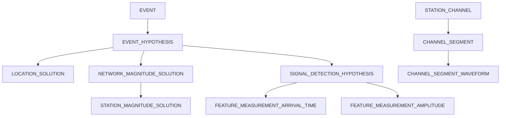

# NDC PLUS Database Schema Documentation
## Overview
The NDC (National Data Center) PLUS database schema supports seismic event monitoring, waveform analysis, and location determination. This is an Oracle database schema with 35 tables organized into functional groups.
## Table Categories
### Channel & Waveform Data
- **CHANNEL_SEGMENT**: Stores time series channel segment information for waveform data
- **CHANNEL_SEGMENT_CREATION**: Tracks creation metadata for channel segments
- **CHANNEL_SEGMENT_PROC_MASK_XREF**: Cross-reference between channel segments and processing masks
- **CHANNEL_SEGMENT_WAVEFORM**: Links channel segments to waveform IDs
- **STATION_CHANNEL**: Station and channel configuration metadata

### Event Management
- **EVENT**: Seismic event master table
- **EVENT_HYPOTHESIS**: Hypotheses about seismic event characteristics
- **EVENT_HYPOTHESIS_TAG**: Tags and classifications for event hypotheses
- **EVENT_STATUS_INFO**: Status and workflow information for events
- **EVENT_CORRELATION**: Correlation analysis between seismic events
- **EVENT_CORRELATION_CHANNEL_SEGMENT**: Channel segments used in event correlation

### Feature Measurements
- **FEATURE_MEASUREMENT_AMPLITUDE**: Amplitude measurements from seismic signals
- **FEATURE_MEASUREMENT_ARRIVAL_TIME**: Arrival time measurements for seismic phases
- **FEATURE_MEASUREMENT_ENUMERATED**: Categorical feature measurements
- **FEATURE_MEASUREMENT_NUMERIC**: Numeric feature measurements

### Feature Predictions
- **FEATURE_PREDICTION_ARRIVAL_TIME**: Predicted arrival times for seismic phases
- **FEATURE_PREDICTION_COMPONENT**: Component-specific feature predictions
- **FEATURE_PREDICTION_NUMERIC**: Numeric feature predictions

### Location & Uncertainty
- **LOCATION_SOLUTION**: Calculated geographic locations for events
- **LOCATION_BEHAVIOR**: Location calculation behavior and parameters
- **LOCATION_RESTRAINT**: Constraints and restraints for location calculations
- **LOCATION_UNCERTAINTY**: Uncertainty estimates for event locations
- **LOCATION_UNCERTAINTY_ELLIPSE**: Elliptical uncertainty representation
- **LOCATION_UNCERTAINTY_ELLIPSOID**: Ellipsoidal 3D uncertainty representation

### Magnitude Calculations
- **NETWORK_MAGNITUDE_SOLUTION**: Network-level magnitude calculations
- **STATION_MAGNITUDE_SOLUTION**: Station-level magnitude calculations

### Quality Control
- **PROCESSING_MASK**: Data quality masks and processing intervals
- **PROCESSING_MASK_QC_SEGMENT_VERSION**: Links processing masks to QC segments
- **QC_SEGMENT_VERSION**: Quality control segment versions

### Signal Detection
- **SIGNAL_DETECTION_HYPOTHESIS**: Signal detection hypotheses and picks
- **INTERVAL**: Time intervals for processing and analysis

### Metadata & Configuration
- **STATION_GROUP_VERSION**: Station group definitions and versions
- **RESPONSE_TABLE**: Instrument response specifications
- **REMARK**: Comments and annotations
- **STAGE_METRICS**: Performance metrics for processing stages

## Key Relationships

## Detailed Table Specifications
### CHANNEL_SEGMENT
**Description**: Stores time series channel segment information for waveform data

**Column Count**: 10

| Column | Type | Nullable | Primary Key |
|--------|------|----------|-------------|
| UUID | NOT NULL RAW(16) | Yes |  |
| CHANNEL_SEGMENT_CREATION_UUID | RAW(16) | Yes |  |
| REFERENCE_ID | RAW(16) | Yes |  |
| CREATION_TIME | TIMESTAMP(6) | Yes |  |
| CHAN_CANONICAL_NAME | VARCHAR2(32) | Yes |  |
| CHAN_EFFECTIVE_AT | TIMESTAMP(6) | Yes |  |
| TIME_SERIES_TYPE | VARCHAR2(32) | Yes |  |
| START_TIME | TIMESTAMP(6) | Yes |  |
| END_TIME | TIMESTAMP(6) | Yes |  |
| LDDATE | TIMESTAMP(6) | Yes |  |

**Relationships**:
- References **CHANNEL_SEGMENT_CREATION**.UUID via CHANNEL_SEGMENT_CREATION_UUID
- Referenced by **CHANNEL_SEGMENT_PROC_MASK_XREF**.CHANNEL_SEGMENT_UUID
- Referenced by **CHANNEL_SEGMENT_WAVEFORM**.CHANNEL_SEGMENT_UUID
- Referenced by **EVENT_CORRELATION_CHANNEL_SEGMENT**.CHANNEL_SEGMENT_GID

---

### CHANNEL_SEGMENT_CREATION
**Description**: Tracks creation metadata for channel segments

**Column Count**: 3

| Column | Type | Nullable | Primary Key |
|--------|------|----------|-------------|
| UUID | NOT NULL RAW(16) | Yes |  |
| OBJECT | CLOB | Yes |  |
| LDDATE | TIMESTAMP(6) | Yes |  |

**Relationships**:
- Referenced by **CHANNEL_SEGMENT**.CHANNEL_SEGMENT_CREATION_UUID

---

### CHANNEL_SEGMENT_PROC_MASK_XREF
**Description**: Cross-reference between channel segments and processing masks

**Column Count**: 6

| Column | Type | Nullable | Primary Key |
|--------|------|----------|-------------|
| UUID | NOT NULL RAW(16) | Yes |  |
| CHANNEL_SEGMENT_UUID | RAW(16) | Yes |  |
| PROCESSING_MASK_UUID | RAW(16) | Yes |  |
| ISCURRENT | VARCHAR2(1) | Yes |  |
| MODDATE | TIMESTAMP(6) | Yes |  |
| LDDATE | TIMESTAMP(6) | Yes |  |

**Relationships**:
- References **CHANNEL_SEGMENT**.UUID via CHANNEL_SEGMENT_UUID
- References **PROCESSING_MASK**.UUID via PROCESSING_MASK_UUID

---

### CHANNEL_SEGMENT_WAVEFORM
**Description**: Links channel segments to waveform IDs

**Column Count**: 6

| Column | Type | Nullable | Primary Key |
|--------|------|----------|-------------|
| UUID | NOT NULL RAW(16) | Yes |  |
| CHANNEL_SEGMENT_UUID | RAW(16) | Yes |  |
| WFID | NUMBER(18) | Yes |  |
| ISCURRENT | VARCHAR2(1) | Yes |  |
| MODDATE | TIMESTAMP(6) | Yes |  |
| LDDATE | TIMESTAMP(6) | Yes |  |

**Relationships**:
- References **CHANNEL_SEGMENT**.UUID via CHANNEL_SEGMENT_UUID
- References **WAVEFORM**.WFID via WFID

---

### EVENT
**Description**: Seismic event master table

**Column Count**: 4

| Column | Type | Nullable | Primary Key |
|--------|------|----------|-------------|
| UUID | NOT NULL RAW(16) | Yes |  |
| REMARK_GID | RAW(16) | Yes |  |
| MONITORING_ORGANIZATION | VARCHAR2(32) | Yes |  |
| LDDATE | TIMESTAMP(6) | Yes |  |

**Relationships**:
- References **REMARK**.UUID via REMARK_GID
- Referenced by **EVENT_HYPOTHESIS**.EVENT_UUID
- Referenced by **EVENT_STATUS_INFO**.EVENT_UUID

---

### EVENT_CORRELATION
**Description**: Correlation analysis between seismic events

**Column Count**: 17

| Column | Type | Nullable | Primary Key |
|--------|------|----------|-------------|
| UUID | NOT NULL RAW(16) | Yes |  |
| SOURCE_EVENT_HYPOTHESIS_UUID | RAW(16) | Yes |  |
| SIMILAR_EVENT_HYPOTHESIS_UUID | RAW(16) | Yes |  |
| SOURCE_EVENT_CHANNEL_SEGMENT_GID | RAW(16) | Yes |  |
| SIMILAR_EVENT_CHANNEL_SEGMENT_GID | RAW(16) | Yes |  |
| STA_NAME | VARCHAR2(6) | Yes |  |
| STA_EFFECTIVE_AT | TIMESTAMP(6) | Yes |  |
| CHAN_LIST | VARCHAR2(2000) | Yes |  |
| FILTERID | NUMBER(18) | Yes |  |
| SCAN_TYPE | VARCHAR2(32) | Yes |  |
| SCAN_STAGES | VARCHAR2(32) | Yes |  |
| CORRELATION_COEFFICIENT | BINARY_FLOAT | Yes |  |
| AUTHOR | VARCHAR2(32) | Yes |  |
| STAGE | VARCHAR2(32) | Yes |  |
| ISCURRENT | VARCHAR2(1) | Yes |  |
| MODDATE | TIMESTAMP(6) | Yes |  |
| LDDATE | TIMESTAMP(6) | Yes |  |

---

### EVENT_CORRELATION_CHANNEL_SEGMENT
**Description**: Channel segments used in event correlation

**Column Count**: 8

| Column | Type | Nullable | Primary Key |
|--------|------|----------|-------------|
| UUID | NOT NULL RAW(16) | Yes |  |
| CHANNEL_SEGMENT_GID | NOT NULL RAW(16) | Yes |  |
| CHAN_CANONICAL_NAME | VARCHAR2(32) | Yes |  |
| CHAN_EFFECTIVE_AT | TIMESTAMP(6) | Yes |  |
| TIME_SERIES_TYPE | VARCHAR2(32) | Yes |  |
| START_TIME | TIMESTAMP(6) | Yes |  |
| END_TIME | TIMESTAMP(6) | Yes |  |
| LDDATE | TIMESTAMP(6) | Yes |  |

**Relationships**:
- References **CHANNEL_SEGMENT**.UUID via CHANNEL_SEGMENT_GID

---

### EVENT_HYPOTHESIS
**Description**: Hypotheses about seismic event characteristics

**Column Count**: 12

| Column | Type | Nullable | Primary Key |
|--------|------|----------|-------------|
| UUID | NOT NULL RAW(16) | Yes |  |
| EVENT_UUID | RAW(16) | Yes |  |
| PREFERRED_LOCATION_SOLUTION_UUID | RAW(16) | Yes |  |
| REMARK_GID | RAW(16) | Yes |  |
| DELETED | VARCHAR2(1) | Yes |  |
| REJECTED | VARCHAR2(1) | Yes |  |
| PREFERRED_BY | VARCHAR2(32) | Yes |  |
| AUTHOR | VARCHAR2(32) | Yes |  |
| STAGE | VARCHAR2(32) | Yes |  |
| ISCURRENT | VARCHAR2(1) | Yes |  |
| MODDATE | TIMESTAMP(6) | Yes |  |
| LDDATE | TIMESTAMP(6) | Yes |  |

**Relationships**:
- References **EVENT**.UUID via EVENT_UUID
- References **REMARK**.UUID via REMARK_GID
- Referenced by **EVENT_HYPOTHESIS_TAG**.EVENT_HYPOTHESIS_UUID
- Referenced by **LOCATION_SOLUTION**.EVENT_HYPOTHESIS_UUID
- Referenced by **NETWORK_MAGNITUDE_SOLUTION**.EVENT_HYPOTHESIS_UUID

---

### EVENT_HYPOTHESIS_TAG
**Description**: Tags and classifications for event hypotheses

**Column Count**: 8

| Column | Type | Nullable | Primary Key |
|--------|------|----------|-------------|
| UUID | NOT NULL RAW(16) | Yes |  |
| EVENT_HYPOTHESIS_UUID | NOT NULL RAW(16) | Yes |  |
| TAG | VARCHAR2(32) | Yes |  |
| AUTHOR | VARCHAR2(32) | Yes |  |
| STAGE | VARCHAR2(32) | Yes |  |
| ISCURRENT | VARCHAR2(1) | Yes |  |
| MODDATE | TIMESTAMP(6) | Yes |  |
| LDDATE | TIMESTAMP(6) | Yes |  |

**Relationships**:
- References **EVENT_HYPOTHESIS**.UUID via EVENT_HYPOTHESIS_UUID

---

### EVENT_STATUS_INFO
**Description**: Status and workflow information for events

**Column Count**: 8

| Column | Type | Nullable | Primary Key |
|--------|------|----------|-------------|
| UUID | NOT NULL RAW(16) | Yes |  |
| EVENT_UUID | RAW(16) | Yes |  |
| EVENT_STATUS | VARCHAR2(16) | Yes |  |
| ACTIVE_ANALYST_IDS | VARCHAR2(256) | Yes |  |
| STAGE | VARCHAR2(32) | Yes |  |
| ISCURRENT | VARCHAR2(1) | Yes |  |
| MODDATE | TIMESTAMP(6) | Yes |  |
| LDDATE | TIMESTAMP(6) | Yes |  |

**Relationships**:
- References **EVENT**.UUID via EVENT_UUID

---

### FEATURE_MEASUREMENT_AMPLITUDE
**Description**: Amplitude measurements from seismic signals

**Column Count**: 18

| Column | Type | Nullable | Primary Key |
|--------|------|----------|-------------|
| UUID | NOT NULL RAW(16) | Yes |  |
| SIG_DET_HYPO_GID | RAW(16) | Yes |  |
| MEASURED_CHANNEL_SEGMENT_UUID | RAW(16) | Yes |  |
| ANALYSIS_CHANNEL_SEGMENT_UUID | RAW(16) | Yes |  |
| FILTERID | NUMBER(18) | Yes |  |
| FILTER_USAGE | VARCHAR2(32) | Yes |  |
| CHAN_CANONICAL_NAME | VARCHAR2(32) | Yes |  |
| CHAN_EFFECTIVE_AT | TIMESTAMP(6) | Yes |  |
| MEASUREMENT_TYPE | VARCHAR2(20) | Yes |  |
| AMPLITUDE | BINARY_FLOAT | Yes |  |
| PERIOD | BINARY_FLOAT | Yes |  |
| UNITS | VARCHAR2(32) | Yes |  |
| CLIPPED | VARCHAR2(1) | Yes |  |
| MEASUREMENT_WINDOW_START_TIME | TIMESTAMP(6) | Yes |  |
| MEASUREMENT_WINDOW_DURATION | BINARY_FLOAT | Yes |  |
| MEASUREMENT_TIME | TIMESTAMP(6) | Yes |  |
| SNR | BINARY_FLOAT | Yes |  |
| LDDATE | TIMESTAMP(6) | Yes |  |

**Relationships**:
- Referenced by **STATION_MAGNITUDE_SOLUTION**.FEATURE_MEASUREMENT_AMPLITUDE_UUID

---

### FEATURE_MEASUREMENT_ARRIVAL_TIME
**Description**: Arrival time measurements for seismic phases

**Column Count**: 13

| Column | Type | Nullable | Primary Key |
|--------|------|----------|-------------|
| UUID | NOT NULL RAW(16) | Yes |  |
| SIG_DET_HYPO_GID | RAW(16) | Yes |  |
| MEASURED_CHANNEL_SEGMENT_UUID | RAW(16) | Yes |  |
| ANALYSIS_CHANNEL_SEGMENT_UUID | RAW(16) | Yes |  |
| FILTERID | NUMBER(18) | Yes |  |
| FILTER_USAGE | VARCHAR2(32) | Yes |  |
| CHAN_CANONICAL_NAME | VARCHAR2(32) | Yes |  |
| CHAN_EFFECTIVE_AT | TIMESTAMP(6) | Yes |  |
| MEASUREMENT_TYPE | VARCHAR2(27) | Yes |  |
| ARRIVAL_TIME | TIMESTAMP(6) | Yes |  |
| STANDARD_DEVIATION | BINARY_FLOAT | Yes |  |
| SNR | BINARY_FLOAT | Yes |  |
| LDDATE | TIMESTAMP(6) | Yes |  |

---

### FEATURE_MEASUREMENT_ENUMERATED
**Description**: Categorical feature measurements

**Column Count**: 14

| Column | Type | Nullable | Primary Key |
|--------|------|----------|-------------|
| UUID | NOT NULL RAW(16) | Yes |  |
| SIG_DET_HYPO_GID | RAW(16) | Yes |  |
| MEASURED_CHANNEL_SEGMENT_UUID | RAW(16) | Yes |  |
| ANALYSIS_CHANNEL_SEGMENT_UUID | RAW(16) | Yes |  |
| FILTERID | NUMBER(18) | Yes |  |
| FILTER_USAGE | VARCHAR2(32) | Yes |  |
| CHAN_CANONICAL_NAME | VARCHAR2(32) | Yes |  |
| CHAN_EFFECTIVE_AT | TIMESTAMP(6) | Yes |  |
| MEASUREMENT_TYPE | VARCHAR2(20) | Yes |  |
| MEASURED_VALUE | VARCHAR2(13) | Yes |  |
| CONFIDENCE | BINARY_FLOAT | Yes |  |
| REFERENCE_TIME | TIMESTAMP(6) | Yes |  |
| SNR | BINARY_FLOAT | Yes |  |
| LDDATE | TIMESTAMP(6) | Yes |  |

---

### FEATURE_MEASUREMENT_NUMERIC
**Description**: Numeric feature measurements

**Column Count**: 15

| Column | Type | Nullable | Primary Key |
|--------|------|----------|-------------|
| UUID | NOT NULL RAW(16) | Yes |  |
| SIG_DET_HYPO_GID | RAW(16) | Yes |  |
| MEASURED_CHANNEL_SEGMENT_UUID | RAW(16) | Yes |  |
| ANALYSIS_CHANNEL_SEGMENT_UUID | RAW(16) | Yes |  |
| FILTERID | NUMBER(18) | Yes |  |
| FILTER_USAGE | VARCHAR2(32) | Yes |  |
| CHAN_CANONICAL_NAME | VARCHAR2(32) | Yes |  |
| CHAN_EFFECTIVE_AT | TIMESTAMP(6) | Yes |  |
| MEASUREMENT_TYPE | VARCHAR2(27) | Yes |  |
| MEASURED_VALUE | BINARY_FLOAT | Yes |  |
| UNITS | VARCHAR2(32) | Yes |  |
| STANDARD_DEVIATION | BINARY_FLOAT | Yes |  |
| REFERENCE_TIME | TIMESTAMP(6) | Yes |  |
| SNR | BINARY_FLOAT | Yes |  |
| LDDATE | TIMESTAMP(6) | Yes |  |

---

### FEATURE_PREDICTION_ARRIVAL_TIME
**Description**: Predicted arrival times for seismic phases

**Column Count**: 11

| Column | Type | Nullable | Primary Key |
|--------|------|----------|-------------|
| UUID | NOT NULL RAW(16) | Yes |  |
| LOCATION_BEHAVIOR_UUID | RAW(16) | Yes |  |
| CHAN_CANONICAL_NAME | VARCHAR2(32) | Yes |  |
| CHAN_EFFECTIVE_AT | TIMESTAMP(6) | Yes |  |
| PHASE | VARCHAR2(8) | Yes |  |
| PREDICTION_TYPE | VARCHAR2(27) | Yes |  |
| ARRIVAL_TIME | TIMESTAMP(6) | Yes |  |
| TRAVEL_TIME | BINARY_FLOAT | Yes |  |
| STANDARD_DEVIATION | BINARY_FLOAT | Yes |  |
| EXTRAPOLATED | VARCHAR2(1) | Yes |  |
| LDDATE | TIMESTAMP(6) | Yes |  |

**Relationships**:
- References **LOCATION_BEHAVIOR**.UUID via LOCATION_BEHAVIOR_UUID

---

### FEATURE_PREDICTION_COMPONENT
**Description**: Component-specific feature predictions

**Column Count**: 6

| Column | Type | Nullable | Primary Key |
|--------|------|----------|-------------|
| UUID | NOT NULL RAW(16) | Yes |  |
| FEATURE_PREDICTION_UUID | RAW(16) | Yes |  |
| PREDICTION_COMPONENT_TYPE | VARCHAR2(35) | Yes |  |
| VALUE | BINARY_FLOAT | Yes |  |
| EXTRAPOLATED | VARCHAR2(1) | Yes |  |
| LDDATE | TIMESTAMP(6) | Yes |  |

---

### FEATURE_PREDICTION_NUMERIC
**Description**: Numeric feature predictions

**Column Count**: 11

| Column | Type | Nullable | Primary Key |
|--------|------|----------|-------------|
| UUID | NOT NULL RAW(16) | Yes |  |
| LOCATION_BEHAVIOR_UUID | RAW(16) | Yes |  |
| CHAN_CANONICAL_NAME | VARCHAR2(32) | Yes |  |
| CHAN_EFFECTIVE_AT | TIMESTAMP(6) | Yes |  |
| PHASE | VARCHAR2(8) | Yes |  |
| PREDICTION_TYPE | VARCHAR2(27) | Yes |  |
| PREDICTED_VALUE | BINARY_FLOAT | Yes |  |
| UNITS | VARCHAR2(32) | Yes |  |
| STANDARD_DEVIATION | BINARY_FLOAT | Yes |  |
| EXTRAPOLATED | VARCHAR2(1) | Yes |  |
| LDDATE | TIMESTAMP(6) | Yes |  |

**Relationships**:
- References **LOCATION_BEHAVIOR**.UUID via LOCATION_BEHAVIOR_UUID

---

### INTERVAL
**Description**: Time intervals for processing and analysis

**Column Count**: 20

| Column | Type | Nullable | Primary Key |
|--------|------|----------|-------------|
| UUID | NOT NULL RAW(16) | Yes |  |
| INTERVAL_GID | RAW(16) | Yes |  |
| REMARK_GID | RAW(16) | Yes |  |
| STATUS | VARCHAR2(16) | Yes |  |
| START_TIME | TIMESTAMP(6) | Yes |  |
| END_TIME | TIMESTAMP(6) | Yes |  |
| PROCESSING_START_TIME | TIMESTAMP(6) | Yes |  |
| PROCESSING_END_TIME | TIMESTAMP(6) | Yes |  |
| PERCENT_COMPLETED | BINARY_FLOAT | Yes |  |
| ACTIVE_ANALYST_IDS | VARCHAR2(256) | Yes |  |
| RESERVED_ANALYST_ID | VARCHAR2(32) | Yes |  |
| COMPLETED_ANALYST_ID | VARCHAR2(32) | Yes |  |
| AUTHOR | VARCHAR2(32) | Yes |  |
| STAGE | VARCHAR2(32) | Yes |  |
| STAGE_MODE | VARCHAR2(32) | Yes |  |
| SUB_STAGE | VARCHAR2(64) | Yes |  |
| LAST_EXECUTED_STEP_NAME | VARCHAR2(32) | Yes |  |
| ISCURRENT | VARCHAR2(1) | Yes |  |
| MODDATE | TIMESTAMP(6) | Yes |  |
| LDDATE | TIMESTAMP(6) | Yes |  |

**Relationships**:
- References **INTERVAL**.UUID via INTERVAL_GID
- References **REMARK**.UUID via REMARK_GID
- Referenced by **STAGE_METRICS**.INTERVAL_UUID
- Referenced by **STAGE_METRICS**.INTERVAL_GID

---

### LOCATION_BEHAVIOR
**Description**: Location calculation behavior and parameters

**Column Count**: 11

| Column | Type | Nullable | Primary Key |
|--------|------|----------|-------------|
| UUID | NOT NULL RAW(16) | Yes |  |
| LOCATION_SOLUTION_UUID | RAW(16) | Yes |  |
| SIG_DET_HYPO_GID | RAW(16) | Yes |  |
| FEATURE_MEASUREMENT_UUID | RAW(16) | Yes |  |
| FEATURE_PREDICTION_UUID | RAW(16) | Yes |  |
| VALUE_TYPE | VARCHAR2(12) | Yes |  |
| DEFINING | VARCHAR2(1) | Yes |  |
| REQUESTED_DEFINING | VARCHAR2(1) | Yes |  |
| RESIDUAL | BINARY_FLOAT | Yes |  |
| WEIGHT | BINARY_FLOAT | Yes |  |
| LDDATE | TIMESTAMP(6) | Yes |  |

**Relationships**:
- Referenced by **FEATURE_PREDICTION_ARRIVAL_TIME**.LOCATION_BEHAVIOR_UUID
- Referenced by **FEATURE_PREDICTION_NUMERIC**.LOCATION_BEHAVIOR_UUID
- References **LOCATION_SOLUTION**.UUID via LOCATION_SOLUTION_UUID

---

### LOCATION_RESTRAINT
**Description**: Constraints and restraints for location calculations

**Column Count**: 12

| Column | Type | Nullable | Primary Key |
|--------|------|----------|-------------|
| UUID | NOT NULL RAW(16) | Yes |  |
| LOCATION_SOLUTION_UUID | RAW(16) | Yes |  |
| DEPTH_RESTRAINT_TYPE | VARCHAR2(12) | Yes |  |
| DEPTH_RESTRAINT_KM | BINARY_FLOAT | Yes |  |
| DEPTH_RESTRAINT_REASON | VARCHAR2(51) | Yes |  |
| EPICENTER_RESTRAINT_TYPE | VARCHAR2(12) | Yes |  |
| LATITUDE_RESTRAINT_DEG | BINARY_FLOAT | Yes |  |
| LONGITUDE_RESTRAINT_DEG | BINARY_FLOAT | Yes |  |
| TIME_RESTRAINT_TYPE | VARCHAR2(12) | Yes |  |
| TIME_RESTRAINT | TIMESTAMP(6) | Yes |  |
| RESTRAINER | VARCHAR2(22) | Yes |  |
| LDDATE | TIMESTAMP(6) | Yes |  |

**Relationships**:
- References **LOCATION_SOLUTION**.UUID via LOCATION_SOLUTION_UUID

---

### LOCATION_SOLUTION
**Description**: Calculated geographic locations for events

**Column Count**: 15

| Column | Type | Nullable | Primary Key |
|--------|------|----------|-------------|
| UUID | NOT NULL RAW(16) | Yes |  |
| EVENT_HYPOTHESIS_UUID | RAW(16) | Yes |  |
| REMARK_GID | RAW(16) | Yes |  |
| LAT | BINARY_FLOAT | Yes |  |
| LON | BINARY_FLOAT | Yes |  |
| DEPTH | BINARY_FLOAT | Yes |  |
| TIME | TIMESTAMP(6) | Yes |  |
| GRN | NUMBER(8) | Yes |  |
| SRN | NUMBER(8) | Yes |  |
| ALGORITHM | VARCHAR2(15) | Yes |  |
| AUTHOR | VARCHAR2(32) | Yes |  |
| STAGE | VARCHAR2(32) | Yes |  |
| ISCURRENT | VARCHAR2(1) | Yes |  |
| MODDATE | TIMESTAMP(6) | Yes |  |
| LDDATE | TIMESTAMP(6) | Yes |  |

**Relationships**:
- Referenced by **LOCATION_BEHAVIOR**.LOCATION_SOLUTION_UUID
- Referenced by **LOCATION_RESTRAINT**.LOCATION_SOLUTION_UUID
- References **EVENT_HYPOTHESIS**.UUID via EVENT_HYPOTHESIS_UUID
- References **REMARK**.UUID via REMARK_GID
- Referenced by **LOCATION_UNCERTAINTY**.LOCATION_SOLUTION_UUID
- Referenced by **NETWORK_MAGNITUDE_SOLUTION**.LOCATION_SOLUTION_UUID

---

### LOCATION_UNCERTAINTY
**Description**: Uncertainty estimates for event locations

**Column Count**: 18

| Column | Type | Nullable | Primary Key |
|--------|------|----------|-------------|
| UUID | NOT NULL RAW(16) | Yes |  |
| LOCATION_SOLUTION_UUID | RAW(16) | Yes |  |
| REMARK_GID | RAW(16) | Yes |  |
| XX | BINARY_FLOAT | Yes |  |
| YY | BINARY_FLOAT | Yes |  |
| ZZ | BINARY_FLOAT | Yes |  |
| TT | BINARY_FLOAT | Yes |  |
| XY | BINARY_FLOAT | Yes |  |
| XZ | BINARY_FLOAT | Yes |  |
| YZ | BINARY_FLOAT | Yes |  |
| TX | BINARY_FLOAT | Yes |  |
| TY | BINARY_FLOAT | Yes |  |
| TZ | BINARY_FLOAT | Yes |  |
| STD_DEV_TRAVEL_TIME_RESIDUALS | BINARY_FLOAT | Yes |  |
| STAGE | VARCHAR2(32) | Yes |  |
| ISCURRENT | VARCHAR2(1) | Yes |  |
| MODDATE | TIMESTAMP(6) | Yes |  |
| LDDATE | TIMESTAMP(6) | Yes |  |

**Relationships**:
- References **LOCATION_SOLUTION**.UUID via LOCATION_SOLUTION_UUID
- References **REMARK**.UUID via REMARK_GID
- Referenced by **LOCATION_UNCERTAINTY_ELLIPSE**.LOCATION_UNCERTAINTY_UUID
- Referenced by **LOCATION_UNCERTAINTY_ELLIPSOID**.LOCATION_UNCERTAINTY_UUID

---

### LOCATION_UNCERTAINTY_ELLIPSE
**Description**: Elliptical uncertainty representation

**Column Count**: 12

| Column | Type | Nullable | Primary Key |
|--------|------|----------|-------------|
| UUID | NOT NULL RAW(16) | Yes |  |
| LOCATION_UNCERTAINTY_UUID | RAW(16) | Yes |  |
| SCALING_FACTOR_TYPE | VARCHAR2(32) | Yes |  |
| K_WEIGHT | BINARY_FLOAT | Yes |  |
| CONFIDENCE_LEVEL | BINARY_FLOAT | Yes |  |
| APRIORI_VARIANCE | BINARY_FLOAT | Yes |  |
| SEMI_MAJOR_AXIS_LENGTH_KM | BINARY_FLOAT | Yes |  |
| SEMI_MAJOR_AXIS_TREND_DEG | BINARY_FLOAT | Yes |  |
| SEMI_MINOR_AXIS_LENGTH_KM | BINARY_FLOAT | Yes |  |
| DEPTH_UNCERTAINTY_KM | BINARY_FLOAT | Yes |  |
| TIME_UNCERTAINTY | BINARY_FLOAT | Yes |  |
| LDDATE | TIMESTAMP(6) | Yes |  |

**Relationships**:
- References **LOCATION_UNCERTAINTY**.UUID via LOCATION_UNCERTAINTY_UUID

---

### LOCATION_UNCERTAINTY_ELLIPSOID
**Description**: Ellipsoidal 3D uncertainty representation

**Column Count**: 17

| Column | Type | Nullable | Primary Key |
|--------|------|----------|-------------|
| UUID | NOT NULL RAW(16) | Yes |  |
| LOCATION_UNCERTAINTY_UUID | RAW(16) | Yes |  |
| SCALING_FACTOR_TYPE | VARCHAR2(32) | Yes |  |
| K_WEIGHT | BINARY_FLOAT | Yes |  |
| CONFIDENCE_LEVEL | BINARY_FLOAT | Yes |  |
| APRIORI_VARIANCE | BINARY_FLOAT | Yes |  |
| SEMI_MAJOR_AXIS_LENGTH_KM | BINARY_FLOAT | Yes |  |
| SEMI_MAJOR_AXIS_TREND_DEG | BINARY_FLOAT | Yes |  |
| SEMI_MAJOR_AXIS_PLUNGE_DEG | BINARY_FLOAT | Yes |  |
| SEMI_INTERMEDIATE_AXIS_LENGTH_KM | BINARY_FLOAT | Yes |  |
| SEMI_INTERMEDIATE_AXIS_TREND_DEG | BINARY_FLOAT | Yes |  |
| SEMI_INTERMEDIATE_AXIS_PLUNGE_DEG | BINARY_FLOAT | Yes |  |
| SEMI_MINOR_AXIS_LENGTH_KM | BINARY_FLOAT | Yes |  |
| SEMI_MINOR_AXIS_TREND_KM | BINARY_FLOAT | Yes |  |
| SEMI_MINOR_AXIS_PLUNGE_KM | BINARY_FLOAT | Yes |  |
| TIME_UNCERTAINTY | BINARY_FLOAT | Yes |  |
| LDDATE | TIMESTAMP(6) | Yes |  |

**Relationships**:
- References **LOCATION_UNCERTAINTY**.UUID via LOCATION_UNCERTAINTY_UUID

---

### NETWORK_MAGNITUDE_SOLUTION
**Description**: Network-level magnitude calculations

**Column Count**: 13

| Column | Type | Nullable | Primary Key |
|--------|------|----------|-------------|
| UUID | NOT NULL RAW(16) | Yes |  |
| LOCATION_SOLUTION_UUID | RAW(16) | Yes |  |
| EVENT_HYPOTHESIS_UUID | RAW(16) | Yes |  |
| REMARK_GID | RAW(16) | Yes |  |
| MAGTYPE | VARCHAR2(6) | Yes |  |
| MAGNITUDE | BINARY_FLOAT | Yes |  |
| UNCERTAINTY | BINARY_FLOAT | Yes |  |
| STATUS | VARCHAR2(32) | Yes |  |
| AUTHOR | VARCHAR2(32) | Yes |  |
| STAGE | VARCHAR2(32) | Yes |  |
| ISCURRENT | VARCHAR2(1) | Yes |  |
| MODDATE | TIMESTAMP(6) | Yes |  |
| LDDATE | TIMESTAMP(6) | Yes |  |

**Relationships**:
- References **LOCATION_SOLUTION**.UUID via LOCATION_SOLUTION_UUID
- References **EVENT_HYPOTHESIS**.UUID via EVENT_HYPOTHESIS_UUID
- References **REMARK**.UUID via REMARK_GID
- Referenced by **STATION_MAGNITUDE_SOLUTION**.NETWORK_MAGNITUDE_SOLUTION_UUID

---

### PROCESSING_MASK
**Description**: Data quality masks and processing intervals

**Column Count**: 8

| Column | Type | Nullable | Primary Key |
|--------|------|----------|-------------|
| UUID | NOT NULL RAW(16) | Yes |  |
| PROCESSING_OPERATION | VARCHAR2(32) | Yes |  |
| RAW_CHAN_CANONICAL_NAME | VARCHAR2(32) | Yes |  |
| RAW_CHAN_EFFECTIVE_AT | TIMESTAMP(6) | Yes |  |
| START_TIME | TIMESTAMP(6) | Yes |  |
| END_TIME | TIMESTAMP(6) | Yes |  |
| EFFECTIVE_AT | TIMESTAMP(6) | Yes |  |
| LDDATE | TIMESTAMP(6) | Yes |  |

**Relationships**:
- Referenced by **CHANNEL_SEGMENT_PROC_MASK_XREF**.PROCESSING_MASK_UUID
- Referenced by **PROCESSING_MASK_QC_SEGMENT_VERSION**.PROCESSING_MASK_UUID

---

### PROCESSING_MASK_QC_SEGMENT_VERSION
**Description**: Links processing masks to QC segments

**Column Count**: 4

| Column | Type | Nullable | Primary Key |
|--------|------|----------|-------------|
| UUID | NOT NULL RAW(16) | Yes |  |
| PROCESSING_MASK_UUID | NOT NULL RAW(16) | Yes |  |
| QC_SEGMENT_VERSION_UUID | NOT NULL RAW(16) | Yes |  |
| LDDATE | TIMESTAMP(6) | Yes |  |

**Relationships**:
- References **PROCESSING_MASK**.UUID via PROCESSING_MASK_UUID
- References **QC_SEGMENT_VERSION**.UUID via QC_SEGMENT_VERSION_UUID

---

### QC_SEGMENT_VERSION
**Description**: Quality control segment versions

**Column Count**: 17

| Column | Type | Nullable | Primary Key |
|--------|------|----------|-------------|
| UUID | NOT NULL RAW(16) | Yes |  |
| QC_SEGMENT_GID | RAW(16) | Yes |  |
| CHAN_CANONICAL_NAME | VARCHAR2(32) | Yes |  |
| CHAN_EFFECTIVE_AT | TIMESTAMP(6) | Yes |  |
| START_TIME | TIMESTAMP(6) | Yes |  |
| END_TIME | TIMESTAMP(6) | Yes |  |
| CATEGORY | VARCHAR2(32) | Yes |  |
| TYPE | VARCHAR2(32) | Yes |  |
| RATIONALE | VARCHAR2(32) | Yes |  |
| REJECTED | VARCHAR2(1) | Yes |  |
| AUTHOR | VARCHAR2(32) | Yes |  |
| STAGE | VARCHAR2(32) | Yes |  |
| ISCURRENT | VARCHAR2(1) | Yes |  |
| EFFECTIVE_AT | TIMESTAMP(6) | Yes |  |
| MODDATE | TIMESTAMP(6) | Yes |  |
| LDDATE | TIMESTAMP(6) | Yes |  |
| QCMASKID | NUMBER(18) | Yes |  |

**Relationships**:
- Referenced by **PROCESSING_MASK_QC_SEGMENT_VERSION**.QC_SEGMENT_VERSION_UUID

---

### REMARK
**Description**: Comments and annotations

**Column Count**: 5

| Column | Type | Nullable | Primary Key |
|--------|------|----------|-------------|
| UUID | NOT NULL RAW(16) | Yes |  |
| REMARK_GID | NOT NULL RAW(16) | Yes |  |
| REMARK | VARCHAR2(256) | Yes |  |
| AUTHOR | VARCHAR2(32) | Yes |  |
| LDDATE | TIMESTAMP(6) | Yes |  |

**Relationships**:
- Referenced by **EVENT**.REMARK_GID
- Referenced by **EVENT_HYPOTHESIS**.REMARK_GID
- Referenced by **INTERVAL**.REMARK_GID
- Referenced by **LOCATION_SOLUTION**.REMARK_GID
- Referenced by **LOCATION_UNCERTAINTY**.REMARK_GID
- Referenced by **NETWORK_MAGNITUDE_SOLUTION**.REMARK_GID
- References **REMARK**.UUID via REMARK_GID
- Referenced by **SIGNAL_DETECTION_HYPOTHESIS**.REMARK_GID
- Referenced by **STATION_MAGNITUDE_SOLUTION**.REMARK_GID

---

### RESPONSE_TABLE
**Description**: Instrument response specifications

**Column Count**: 3

| Column | Type | Nullable | Primary Key |
|--------|------|----------|-------------|
| INID | NOT NULL NUMBER(18) | Yes | ✓ |
| RSPTYPE | NOT NULL VARCHAR2(6) | Yes |  |
| RESPONSE_FILE | CLOB | Yes |  |

---

### SIGNAL_DETECTION_HYPOTHESIS
**Description**: Signal detection hypotheses and picks

**Column Count**: 13

| Column | Type | Nullable | Primary Key |
|--------|------|----------|-------------|
| UUID | NOT NULL RAW(16) | Yes |  |
| PARENT_SIG_DET_HYPO_UUID | RAW(16) | Yes |  |
| SIG_DET_HYPO_GID | RAW(16) | Yes |  |
| REMARK_GID | RAW(16) | Yes |  |
| STA_NAME | VARCHAR2(6) | Yes |  |
| STA_EFFECTIVE_AT | TIMESTAMP(6) | Yes |  |
| MONITORING_ORGANIZATION | VARCHAR2(32) | Yes |  |
| DELETED | VARCHAR2(1) | Yes |  |
| AUTHOR | VARCHAR2(32) | Yes |  |
| STAGE | VARCHAR2(32) | Yes |  |
| ISCURRENT | VARCHAR2(1) | Yes |  |
| MODDATE | TIMESTAMP(6) | Yes |  |
| LDDATE | TIMESTAMP(6) | Yes |  |

**Relationships**:
- References **REMARK**.UUID via REMARK_GID

---

### STAGE_METRICS
**Description**: Performance metrics for processing stages

**Column Count**: 9

| Column | Type | Nullable | Primary Key |
|--------|------|----------|-------------|
| UUID | NOT NULL RAW(16) | Yes |  |
| INTERVAL_UUID | RAW(16) | Yes |  |
| INTERVAL_GID | RAW(16) | Yes |  |
| METRIC_NAME | VARCHAR2(32) | Yes |  |
| METRIC_VALUE | VARCHAR2(32) | Yes |  |
| STAGE | VARCHAR2(32) | Yes |  |
| ISCURRENT | VARCHAR2(1) | Yes |  |
| MODDATE | TIMESTAMP(6) | Yes |  |
| LDDATE | TIMESTAMP(6) | Yes |  |

**Relationships**:
- References **INTERVAL**.UUID via INTERVAL_UUID
- References **INTERVAL**.UUID via INTERVAL_GID

---

### STATION_CHANNEL
**Description**: Station and channel configuration metadata

**Column Count**: 51

| Column | Type | Nullable | Primary Key |
|--------|------|----------|-------------|
| ID | NOT NULL RAW(16) | Yes |  |
| STA_NAME | VARCHAR2(6) | Yes |  |
| STA_DESCRIPTION | VARCHAR2(50) | Yes |  |
| STA_TYPE | VARCHAR2(19) | Yes |  |
| STA_LAT | BINARY_FLOAT | Yes |  |
| STA_LON | BINARY_FLOAT | Yes |  |
| STA_ELEV | BINARY_FLOAT | Yes |  |
| CHAN_GRP_NAME | VARCHAR2(6) | Yes |  |
| CHAN_GRP_DESCRIPTION | VARCHAR2(50) | Yes |  |
| CHAN_GRP_TYPE | VARCHAR2(50) | Yes |  |
| CHAN_GRP_LAT | BINARY_FLOAT | Yes |  |
| CHAN_GRP_LON | BINARY_FLOAT | Yes |  |
| CHAN_GRP_ELEV | BINARY_FLOAT | Yes |  |
| CHAN_GRP_NORTH_DISPLACEMENT | BINARY_FLOAT | Yes |  |
| CHAN_GRP_EAST_DISPLACEMENT | BINARY_FLOAT | Yes |  |
| CHAN_NAME | VARCHAR2(8) | Yes |  |
| CHAN_CANONICAL_NAME | VARCHAR2(32) | Yes |  |
| CHAN_DESCRIPTION | VARCHAR2(50) | Yes |  |
| CHAN_DATA_TYPE | VARCHAR2(13) | Yes |  |
| CHAN_LAT | BINARY_FLOAT | Yes |  |
| CHAN_LON | BINARY_FLOAT | Yes |  |
| CHAN_ELEV | BINARY_FLOAT | Yes |  |
| CHAN_EDEPTH | BINARY_FLOAT | Yes |  |
| CHAN_HANG | BINARY_FLOAT | Yes |  |
| CHAN_VANG | BINARY_FLOAT | Yes |  |
| CHAN_BAND_TYPE | VARCHAR2(39) | Yes |  |
| CHAN_INSTRUMENT_TYPE | VARCHAR2(21) | Yes |  |
| CHAN_ORIENTATION_CODE | VARCHAR2(1) | Yes |  |
| CHAN_ORIENTATION_TYPE | VARCHAR2(12) | Yes |  |
| CHAN_SAMPRATE | BINARY_FLOAT | Yes |  |
| CHAN_UNITS | VARCHAR2(22) | Yes |  |
| CHANID | NUMBER(18) | Yes |  |
| RESPONSE_CAL_FACTOR | BINARY_FLOAT | Yes |  |
| RESPONSE_CAL_PERIOD | BINARY_FLOAT | Yes |  |
| RESPONSE_CAL_TIMESHIFT | BINARY_FLOAT | Yes |  |
| INID | NUMBER(18) | Yes | ✓ |
| STA_EFFECTIVE_AT | TIMESTAMP(6) | Yes |  |
| STA_EFFECTIVE_UNTIL | TIMESTAMP(6) | Yes |  |
| STA_UPDATED_AT | TIMESTAMP(6) | Yes |  |
| CHAN_GRP_EFFECTIVE_AT | TIMESTAMP(6) | Yes |  |
| CHAN_GRP_EFFECTIVE_UNTIL | TIMESTAMP(6) | Yes |  |
| CHAN_GRP_UPDATED_AT | TIMESTAMP(6) | Yes |  |
| CHAN_EFFECTIVE_AT | TIMESTAMP(6) | Yes |  |
| CHAN_EFFECTIVE_UNTIL | TIMESTAMP(6) | Yes |  |
| CHAN_UPDATED_AT | TIMESTAMP(6) | Yes |  |
| RESPONSE_EFFECTIVE_AT | TIMESTAMP(6) | Yes |  |
| RESPONSE_EFFECTIVE_UNTIL | TIMESTAMP(6) | Yes |  |
| RESPONSE_UPDATED_AT | TIMESTAMP(6) | Yes |  |
| ISCURRENT | NOT NULL VARCHAR2(1) | Yes |  |
| MODDATE | TIMESTAMP(6) | Yes |  |
| LDDATE | TIMESTAMP(6) | Yes |  |

---

### STATION_GROUP_VERSION
**Description**: Station group definitions and versions

**Column Count**: 6

| Column | Type | Nullable | Primary Key |
|--------|------|----------|-------------|
| STA_GRP_NAME | NOT NULL VARCHAR2(8) | Yes | ✓ |
| STA_GRP_DESCRIPTION | VARCHAR2(120) | Yes |  |
| STA_GRP_EFFECTIVE_AT | NOT NULL TIMESTAMP(6) | Yes |  |
| STA_GRP_EFFECTIVE_UNTIL | TIMESTAMP(6) | Yes |  |
| STA_GRP_UPDATED_AT | TIMESTAMP(6) | Yes |  |
| LDDATE | TIMESTAMP(6) | Yes |  |

---

### STATION_MAGNITUDE_SOLUTION
**Description**: Station-level magnitude calculations

**Column Count**: 23

| Column | Type | Nullable | Primary Key |
|--------|------|----------|-------------|
| UUID | NOT NULL RAW(16) | Yes |  |
| FEATURE_MEASUREMENT_AMPLITUDE_UUID | RAW(16) | Yes |  |
| NETWORK_MAGNITUDE_SOLUTION_UUID | RAW(16) | Yes |  |
| REMARK_GID | RAW(16) | Yes |  |
| STA_NAME | VARCHAR2(6) | Yes |  |
| STA_EFFECTIVE_AT | TIMESTAMP(6) | Yes |  |
| PHASE | VARCHAR2(8) | Yes |  |
| DELTA | BINARY_FLOAT | Yes |  |
| MAGTYPE | VARCHAR2(6) | Yes |  |
| MAGNITUDE | BINARY_FLOAT | Yes |  |
| UNCERTAINTY | BINARY_FLOAT | Yes |  |
| RESIDUAL | BINARY_FLOAT | Yes |  |
| WEIGHT | BINARY_FLOAT | Yes |  |
| DEFINING | VARCHAR2(1) | Yes |  |
| REQUESTED_DEFINING | VARCHAR2(32) | Yes |  |
| ATTENUATION_MODEL | VARCHAR2(32) | Yes |  |
| MODEL_CORRECTION | BINARY_FLOAT | Yes |  |
| STATION_CORRECTION | BINARY_FLOAT | Yes |  |
| AUTHOR | VARCHAR2(32) | Yes |  |
| STAGE | VARCHAR2(32) | Yes |  |
| ISCURRENT | VARCHAR2(1) | Yes |  |
| MODDATE | TIMESTAMP(6) | Yes |  |
| LDDATE | TIMESTAMP(6) | Yes |  |

**Relationships**:
- References **FEATURE_MEASUREMENT_AMPLITUDE**.UUID via FEATURE_MEASUREMENT_AMPLITUDE_UUID
- References **NETWORK_MAGNITUDE_SOLUTION**.UUID via NETWORK_MAGNITUDE_SOLUTION_UUID
- References **REMARK**.UUID via REMARK_GID

---

